> [!tip] Ein Blick zurück

```mermaid 
graph TB 
course_title{{Lektion 10}} 
g1{{Präteritum}}
course_title --> g1
```



## ## 🔰Vokabeln
### Vorübung

| Deutsch              | ENGLISCH      | INFO |
| -------------------- | ------------- | ---- |
| <span style="color:red">der</span> Blick,-e         | glimpse       |      |
| gestern              | yesterday     |      |
| <span style="color:red">der</span> Ausflug,-flüge   | pinic         |      |
| einen Ausflug machen | take a picnic |      |
| <span style="color:blue">die</span> Sitzung,-en      | meeting       |      |


___
### Text 1

| Deutsch                                                    | ENGLISCH                                         | INFO  |
| ---------------------------------------------------------- | ------------------------------------------------ | ----- |
| <span style="color:green">das</span> Chaos                 | chaos                                            | ka:ɔs |
| außerdem                                                   | also,further more                                |       |
| <span style="color:red">der</span> Nachttisch,-e          | bedside table                                    |       |
| <span style="color:blue">die</span> Zeitschrift,-en        | magazine                                         |       |
| <span style="color:red">der</span> Comic,-s                | comic                                            | Engl. |
| <span style="color:blue">die</span> Pinnwand,-wände        | pinboard                                         |       |
| <span style="color:green">das</span> Pinboard,-s           | = *<span style="color:blue">die</span> Pinnwand* | Engl. |
| <span style="color:blue">die</span> Hosentasche,-n         | trouser pocket                                   |       |
| früher                                                     | adj.&adv. earlier                                |       |
| <span style="color:red">der</span> Künchenschrank,schränke |                                                  |       |
| <span style="color:blue">die</span> Jacke,-n               | jacket                                           |       |
| <span style="color:blue">die</span> Nase,-n                | nose                                             |       |
| <span style="color:red">der</span> Schi/Ski,-er            | skiiboard                                        |       |

![[07 L10 V Voruebung.mp3]]
___
### Text 2

| Deutsch                                   | ENGLISCH                  | INFO                    |
| ----------------------------------------- | ------------------------- | ----------------------- |
| Schi/Ski laufen/fahren                    | to skate                  |                         |
| <span style="color:red">der</span> Krach  | noise                     |                         |
| Krach haben                               | make noise                |                         |
| Schluss machen                            | to sign off               |                         |
| etwas                                     | something                 | immer 3.Person Singular |
| <span style="color:red">der</span> Streit | dispute,conflict,quarrel  |                         |
| Schiurlaub machen                         | go to a skiing vacation   |                         |
| ewig                                      | adj.eternal adv.forever   |                         |
| zusammen bleiben                          | stay together,be along    |                         |
| Tatsächlich?                              | Really?                   |                         |
| Schade!                                   | What a shame!What a pity! |                         |

![[08 L10 V T2.mp3]]
___
### Text 3

| Deutsch                   | ENGLISCH                               | INFO               |
| ------------------------- | -------------------------------------- | ------------------ |
| unheimlich                | adj.mysterious,uncanny adv.suprisingly |                    |
| <span style="color:red">der</span> Vorstand,-stände      | board                                  |                    |
| der/<span style="color:blue">die</span> Vorsitzende       | president                              | wie Adj.           |
| <span style="color:red">der</span> Abteilungsleiter,-    | head of department                     |                    |
| <span style="color:blue">die</span> Konferenz,-en         | conference                             |                    |
| <span style="color:green">das</span> Arbeitsessen          | working meal                           |                    |
| <span style="color:green">das</span> Ergebnis,-se          | result                                 |                    |
| offiziell                 | adj. official                          |                    |
| <span style="color:red">der</span> Teil,-e               | part                                   |                    |
| <span style="color:blue">die</span> Delegation,-en        | delegation                             |                    |
| <span style="color:blue">die</span> Stadtrundfahrt,-en    | city tour                              |                    |
| rund                      | adj. round                             |                    |
| <span style="color:green">das</span> Rund,-e               | round                                  |                    |
| eine Stadtrundfahrt maken | tour around the city                   |                    |
| organisieren              | to organize                            |                    |
| erfolgreich               | successful,prosperous                  |                    |
| <span style="color:red">der</span> Erfolg,-e             | success                                |                    |
| <span style="color:green">das</span> Joint Venture，-s     | <合资公司>                             | Engl.              |
| gründen                   | to establish,found,lauch               | <-<span style="color:red">der</span> Grund,ü-e    |
| <span style="color:red">der</span> Manager,-             | manager                                | Engl.              |
| <span style="color:red">der</span> Betrieb,-e            | enterprise                             |                    |
| <span style="color:red">der</span> Großbetrieb,-e        | large enterprise                       |                    |
| <span style="color:green">das</span> Meeting,-s            | meeting                                |                    |
| <span style="color:green">das</span> Equipment,-s          | equipment                              |                    |
| <span style="color:red">der</span> Boss,-e               | boss                                   | #⚠️Plural          |
| kaum                      | hardly                                 |                    |
| <span style="color:blue">die</span> Grippe,-n             | flu 🤧                                 |                    |
| berichten                 | to report                              | +Dat. über/von #⭐Wichtig |
| hoffen                    | to hope                                | +Akku. /auf+Aku    |
| <span style="color:green">das</span> Weihnachten,-         | Chirstmas                              |                    |
| <span style="color:green">das</span> Neujarh               | new year                               |                    |
| träumen                   | to dream (of)                              | von                   |

![[09 L10 V T3.mp3]]
___
### Wörter

| Deutsch                                             | ENGLISCH                     | INFO                  |
| --------------------------------------------------- | ---------------------------- | --------------------- |
| vorgestern                                          | adv.the day before yesterday |                       |
| morgen                                              | adv. tommorow                |                       |
| übermorgen                                          | ad. the day after tommorow   |                       |
| besichtigen                                         | to visit                     |                       |
| diskutieren                                         | to discuss (about)           | über                  |
| der/<span style="color:blue">die</span> Angestellte | employee,staff               | wie Adj.              |
| genug                                               | adj. enough                  | #⭐Wichtig keine Deklination |
| <span style="color:red">der</span> Anfang,-fänge    | beginning,start              |                       |
| effizient                                           | adj.efficient                |                       |
| <span style="color:green">das</span> Sprachspeil,-e | language game                |                       |
| dauernd                                             | adj.permanent,constant       |                       |
| mindestens                                          | at least                     |                       |

### Grammatik

| Deutsch                                                  | ENGLISCH               | INFO      |     |
| -------------------------------------------------------- | ---------------------- | --------- | --- |
| baden                                                    | to take a shower       |           |     |
| übersetzen                                               | to translate           | +Akku.    |     |
| fotographieren                                           | to shoot,take photo of | +Akku.    |     |
| glauben                                                  | to believe             | +Akku.    |     |
| markieren                                                | to mark                | +Akku.    |     |
| <span style="color:green">das</span> Wetter,-            | weather                |           |     |
| <span style="color:red">der</span> Schischuh,-e          | skiing shoes           |           |     |
| <span style="color:red">der</span> Computerclub,-s       | computer club          |           |     |
| bitten                                                   | to request (on sth.)   | +um Akku. |     |
| <span style="color:red">der</span> Hund,-e               | dog                    |           |     |
| <span style="color:green">das</span> Training,-d         | training               |           |     |
| <span style="color:red">der</span> Umzug,-züge           | move,relocation        |           |     |
| einige                                                   | several                |           |     |
| <span style="color:blue">die</span> Vorbereitung,-en     | preparation            |           |     |
| <span style="color:red">der</span> Studienplatz,-plätze  | <大学学习名额>               |           |     |
| <span style="color:blue">die</span> Tanzparty,-s         | dancing party          |           |     |
| <span style="color:blue">die</span> Kunstausstellung,-en | art exhibition         |           |     |
| <span style="color:green">das</span> Erlebnis,-se        | experience             | #⚠️Plural |     |
| <span style="color:red">der</span> Mensch,-en            | people                 | #⚠️Plural |     |

![[10 L10 V Woerter.mp3]]
___


## 📄Texte 
### T1 : So ein Theater
Das Telefon klingelt.

- Anna : Anna Schubert.
- Thomas: Hallo, Anna. Hier ist Thomas. Ich habe ein Problem. Ich kann die Theaterkarten nicht finden.
- Anna:Du, Thomas, es ist sieben Uhr. In einer Stunde fängt das Theater an! Du willst mich doch abholen und bist noch zu Hause?
- Thomas: Ach, bis zum Theater brauchen wir doch nur 30 Minuten.
- Anna:Na, lange kannst du nicht mehr suchen. Sicher sind sie auf deinem Schreibtisch.
- Thomas: Nein, auf dem Schreibtisch habe ich schon nachgeschaut. Da sind sie nicht.
- Anna:Du, auf deinem Schreibtisch ist immer ein ziemliches Chaos.Hast du wirklich schon unter den Büchern und zwischen deinen Papieren gesucht?
- Thomas: Habe ich, habe ich. Außerdem ist das kein Chaos, sondern meine Ordnung. - Aber wo können die Karten nur sein?
- Anna:Vielleicht in „deiner Ordnung" auf dem Nachttisch unter den Zeitschriften und Comics? Oder hast du sie an deine Pinnwand gehängt?
- Thomas: Am Pinboard hängen sie nicht. Aber ich schau mal auf dem Nachttisch nach. - Nein, auf den Nachttisch habe ich sie auch nicht gelegt.
- Anna:Du, Thomas, hast du sie vielleicht in die Hosentasche gesteckt?
- Thomas: In meine Jeanstasche? - Moment mal. - Ja, wirklich! Da sind sie!
- Anna: So ein Theater!

![[02  L10 T1 So ein Theater.mp3]]
______________
### T2 : Das stimmt was nicht
1. Maria und Max hatten vieleicht streit
- Gero: Hast du schon gehört? Max war allein beim Schifahren.
- Alex: Was? Maria war nicht dabei?
- Gero: Nein.
- Alex: Na so was! Hatten sie Krach?
- Gero: Ich weiß nicht. Aber etwas komisch ist es schon.

2. Maria und Max hatten verscheinlich streit
- Alex: Du, bei Maria und Max stimmt was nicht. Wahrscheinlich hatten sie Streit.
- Ilona: Wirklich?
- Alex: Ja. Maria war nicht mit Max beim Schilaufen.
- Ilona: Na ja, sie hatten schon früher Probleme. Max geht ganz selten mit Maria in die Mensa.
- Alex: Und Maria isst allein?
- Ilona: Allein eigentlich nicht. Vor ein paar Tagen war ich in der Mensa und da war Maria mit einem Studenten beim Essen. Der war ziemlich hübsch.
- Alex: So, so.

3. Maria und Max sind wahrscheinlich nicht mehr zusammen
- Ilona: Weißt du schon? Maria und Max  
- Agnes: Nein. <mark style="background: #ADCCFFA6;">Was ist denn mit ihnen los?  </mark>
- Ilona: Ich weiß es nicht genau. Aber Max hat allein Schiurlaub gemacht und Maria geht ohne ihn in die Mensa. Ich glaube, sie hat einen neuen Freund.  
- Agnes: Interessant! Und ich habe gemeint, <mark style="background: #D2B3FFA6;">die bleiben ewig zusammen.</mark>  
- Ilona: Na, so ist das Leben eben.
> [!info] was ist los?  = *What's going on?* 

4.Die Beziehung von Maria und Max ist<mark style="background: #ADCCFFA6;"> zu Ende</mark>
- Agnes: Du, Maria und Max haben Schluss gemacht.  
- Paul: Tatsächlich?  
- Agnes: Ja, Ilona hat es mir erzählt.  
- Paul:  Eigentlich schade. Max hat so gut zu Maria gepasst.
> [!info] zu Ende = zum Schluss

![[04 L10 T2 Da stimmt was nicht.mp3]]
______
### T3 : Liebe Lis,...
Liebe Lis,

tut mir Leid, wahrscheinlich hast du schon lange auf eine E-Mail gewartet.Aber hier war unheimlich viel los. Du weißt ja, eine Woche lang waren unser Vorstandsvorsitzender, drei Leute aus dem Vorstand und zwei Abteilungsleiter hier. Frau Gao und ich mussten alles vorbereiten. Frau Gao war wunderbar, aber auch ich hatte viel Arbeit. Täglich waren ein bis zwei Konferenzen und meistens ein Arbeitsessen. Spät am Abend haben wir oft im Büro mit den Shanghaier Kollegen über die Ergebnisse gesprochen. Neben dem offiziellen Teil wollte die Delegation noch eine Stadtrundfahrt machen.Frau Gao hat sie organisiert. Shanghai hat allen sehr gut gefallen.

Die Gespräche mit unseren Partnern waren ziemlich erfolgreich. Man will ein Joint Venture in Zhejiang gründen und die Manager von zwei Großbetrieben aus Guangdong haben unsere Firma zu einem Meeting eingeladen. Sie wollen unser Equipment kaufen. Da waren meine Bosse natürlich sehr zufrieden.

Entschuldige, ich schreibe nur über meine Arbeit. Aber ich kann zurzeit kaum an etwas anderes denken.

Wie war denn die Woche bei dir? Wie geht es Maria? In deinem Brief hast du von ihrer Grippe berichtet. Da konnte sie nicht mit zum Schilaufen fahren und Max war sicher etwas traurig. Ist sie jetzt wieder gesund?

Ich hoffe, es geht euch gut. Du musst ja fit sein für deinen Besuch über Weihnachten und Neujahr hier in Shanghai. Ich träume schon davon.

Viele Liebe Größe

Dein Holger

![[05 L10 T3 Liebe Lis,....mp3]]
________________________
## 📖Wörter
### W1 : Zeitadverben - *heute,gestern,morgen*
```mermaid 
graph TB 

t1{{vor drei Tagen:vorvorgestern}}
t2{{in drei Tagen:überübermorgen}}
t1 --> vorgestern
vorgestern --> gestern
gestern --> heute
heute --> morgen
morgen --> übermorgen
übermorgen -->t2
```
1. Welcher Tag ist es heute? -Heute ist Dienstag.
2. Welchen Tag haben wir heute? -Heute haben wir Freitag.

### G2 : *haben* oder *machen*

| haben                                                                        | machen                                          |
| ---------------------------------------------------------------------------- | ----------------------------------------------- |
| + Hast du keinen Appetit?                                                    | - Doch,ich habe viel gejoggt.Das macht Appetit. |
| + Am Wochenende hast du doch keine Arbeit?                                   | - Meinst du,der Haushalt macht keine Arbeit?    |
| Zwischen dir und deinem Freund stimmt doch was nciht?Hattet ihr Krach?       | Mach nicht so einen Krach, ich will schlaffen.  |
| Auf Annas Party hatten wir viel Spaß                                         | Nciht alle Partys machen Spaß                   |
| Zwischen Weihnachten und Neujahr haben viele Arbeiter und Angestelle Urlaub. | Ich mache im Sommer Urlaub                      |
| Zwishcen zwei Unterrichtsstunden haben die Kinder 10 Minuten Pause.          | Genug gelernt! Machen wir Pause.                |

Bei *machen* ist das Subjekt aktiver.

> [!tip] stimmt was nicht.  = 有点不对劲

> [!tip] Krach machen = make noise/start a fight
## 🚦Grammatik
### G1 : Das *heben*-Perfect der Regelmäßigverben
##### 1.Die Bildung des Perfects

|     | V1    |                      | V2       |
| --- | ----- | -------------------- | -------- |
| Ich | habe  | Musik                | ge-hör-t |
| Du  | hast  | mir                  | ge-sag-t |
| Wir | haben | die Deutschabteilung | an-ge-ruf-t.         |
##### 2.Die Bildung des Partizips II
____
1. Verben ohne Vorsilbe : ge -t

|      | Infinitiv | Partizip II |
| ---- | --------- | ----------- |
| ge-t | danken    | gedankt     |
|      | hören     | gehört      |
|      | lernen    | gelernt     |
|      | klingeln  | geklingelt  |
|      | machen    | gemacht     |
|      | suchen    | gesucht     |

___
2.ends with -t -d -n

 | Infinitiv | Partizip II |
 | --------- | ----------- |
 | arbeiten  | gearbeitet  |
 | antworten | geantwortet |
 | baden     | gebadet     |
 | öffnen    | geöfftet    |

___
3.Verben mit unbetonten Vorsilben : *be-,ge-,er-,ver-,ent-*

| Infinitiv     | Partizip II  |
| ------------- | ------------ |
| besuchen      | besucht      |
| erklären      | erklärt      |
| verkaufen     | verkauft     |
| entschuldigen | entschudiget |
____
4.Verben mit *über-,unter-,wieder-* (unbetont)

| Infinitiv    | Partizip II  |
| ------------ | ------------ |
| übersetzen   | übersetzt    |
| wiederholen  | wiederholt   |
| unterrichten | unterrichtet |

_________________
5. Verben mit *-ieren*

| Infinitiv      | Partizip II   |
| -------------- | ------------- |
| studieren      | studiert      |
| telefonieren   | telefoniert   |
| fotographieren | potographiert |

### G2 : Das Präteritum von *haben* und *sein* 

### G3 : Präpositionalergänzung 
> Herr Bode denkt oft an seine Frau und seine Kinder in Deutschland und schreibt Mails an sie. Aber in diesen zwei Wochen hat er viel Arbeit und kann nicht so oft schreiben. Er bittet seine Frau um Entschuldigung. Frau Bode wartet nicht auf seine Antwort und mailt ihrem Mann fast jeden Tag. Sie berichtet über die Kinder und erzählt von der Katze und dem Hund. Sie schreibt, sie träumt schon von der Reise nach Shanghai.

___
##### 1.Verbvalenz

| Verben       | +      | **P**        | Beispiele                                        |
| ------------ | ------ | ------------ | ------------------------------------------------ |
| an/fangen    | +      | (mit)        | Wann fängst du mit der Arbeit an?                |
| antworten    | +(D)+  | (auf Akku.)  | Er hat mir auf eine Frage geantwortet.           |
| beginnen     | +      | (mit)        | Sie beginnt wieder mit dem Training.             |
| berichten    | +(D)+  | (von)        | Sie hat im Brief von den Kindern berichtet.      |
|              | +(D)+  | (über Akku.) | Ich muss dem Chef noch darüber berichten.         |
| bitten       | +(A)+  | (um)         | Er bitte seine Frau um Entschuldigung.            |
| danken       | +(D)+  | (für)        | Anna dankt allen für die Geschenke  .            |
| denken       | +      | (an Akku.)   | Herr Bode denkt oft an seine Kinder.             |
| einladen     | +A+    | (zu)         | Darf ich Sie zum Abendessen einladen.            |
| erzählen     | +(D)+  | (über Akku)  | Herr Bode erzählt seiner Frau über seine Arbeit. |
|              | +(D)+  | (von)        | Er erzählt oft von seiner Familie.               |
| fragen       | +(A)+  | (nach)       | Er fragt im Brief nach der Tochter.              |
| gratulieren  | +(D)+  | (zu)         | Sie gratuliert ihm zum Geburtstag.               |
| helfen       | +(A)+  | (bei)        | Soll ich dir beim Umzug helfen?                  |
| reden        | +      | (über Akku.) | Mann kann über alles reden.                      |
|              | +      | (von)        | Von wem redet ihr eigenlich.                     |
|              | +      | (mit)        | Er redet mit seinem Chef.                        |
| schreiben    | +A     |              | Ich schreibe einen Text.                         |
|              | +(A)/  | (an Akku.)   | Ich schreibe eine Karte (an ihn)                 |
|              | +D+(A) |              | Ich schreibe ihm eine Karte.                     |
| sprechen     | +      | (über Akku.) | Wann sprechen wir mal über die Arbeit.           |
|              | +      | (von)        | Wir haben nur vom Wetter gesprochen.             |
|              | +      | (mit)        | So spricht man nicht mit siener Mutter.          |
| suchen       | +A/    | (nach)       | Die Firma sucht nach einem guten Partner.        |
| telefonieren | +      | (mit)        | Gestern habe ich mit him telefoniert.            |
| träumen      | +      | (von)        | Immer träume ich von dir                          |
| warten       | +      | (auf Akku.)  | Ich habe auf dich schon lang gewartet.            |

____
##### Fragen nach der Präpositionalergängzung
1. P= Person

|          |                  |                                  |
| -------- | ---------------- | -------------------------------- |
| An wen   | denkst du ?      | (Ich denke) an meinen Freund.    |
| Auf wen  | warten Sie?      | (Wir Warten) auf meine Schwester |
| Nach wem | fragt er?        | (Er fragt) nach Anna.            |
| Mit wem  | telefonierst du? | (Ich telefoniert) mit Hans.      |
| Über wen | sprecht ihr?     | (Wir sprechen) über Goethe.      |
| Von wem  | erzählen Sie?    | (Wir erzählen) von den Kindern.  |

2. P=nicht Person

|        |               |                       |
| ------ | ------------- | --------------------- |
| Woran  | denkst du?    | An den Urlaub.        |
| Worauf | warten Sie?   | Auf den Bus.          |
| Wonach | fragst du?    | Nach der Konferenz.   |
| Womit  | beginnst du?  | Mit der Vorbereitung. |
| Woüber | sprecht ihr?  | Über das Wetter.      |
| Wovon  | erzählen Sie? | Von der China-Reise.  |

3. wo+?

|                   |                        |
| ----------------- | ---------------------- |
| wo + bei -> wobei | wo + r + an -> woran   |
| wo + für -> wofür | wo + r + auf -> worauf |
| wo + mit -> womit | wo + r + aus -> woraus |
| wo + zu  -> wozu  | wo + r + um  -> worum  |

Beginnt die Präposition mit einem Vokal , wird ein "r" eigeschonben.


