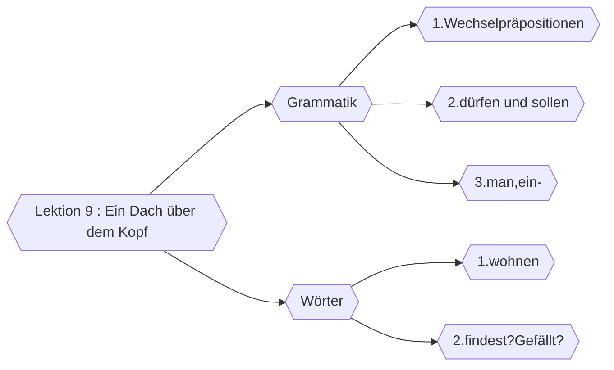

##  🔰Vokabeln

### Vorübung

| DEUTSCH                   | ENGLISCH            | INFO                                                          |
| ------------------------- | ------------------- | ------------------------------------------------------------- |
| das Dach,Dächer           | rooftop             |                                                               |
| über                      | prep.above          | +Dat./Akku.                                                   |
| die Küche,-n              | kitchen             |                                                               |
| das Bad,Bäder             | bath,shower         |                                                               |
| wohin                     | to where            |                                                               |
| das Möbel,-               | furniture           |                                                               |
| der Kühlschrank,-schränke | refrigerator        |                                                               |
| die kommode,-n            | commode             |                                                               |
| das Wohnzimmer,-          | living room         |                                                               |
| stellen                   | to put,settle       | +Akku.+Dir                                                    |
| unter                     | prep. under         | +Dat./+Akku ;  #⭐Wichtig  "unter" ist prep,aber "unten" ist adv. |
| das Arbeitszimmer,-       | workroom,study room |                                                               |
| hängen                    | to hang             | A+Dir                                                         |
| hängen                    | to hang             | +Sit-t                                                        |
| der Flur,-e               | corridor,hall       |                                                               |
| das Bücherregal,-e        | bookshelf           |                                                               |
| neben                     | prep.around         | +Dat./Akku.                                                   |
| zwieschen                 | between             | +Dat./Akku.                                                   |
| die Kiste,-n              | box,crate           |                                                               |

![[06 L9 V Voruebung.mp3]]
___
### Text 1

| DEUTSCH               | ENGLISCH                 | INFO          |
|:--------------------- |:------------------------ |:------------- |
| endlich               | finally                  |               |
| fertig                | ready                    |               |
| finden                | find(something to be...) | #⭐Wichtig +Akku+Adj |
| wunderbar             | wonderful                |               |
| die Idee,-n           | idea                     |               |
| halt                  | stop                     |               |
| warten                | to wait                  | auf+Akku.     |
| schieben #🥵Unbekannt          | to push,move             | +Akku.+Dir.   |
| die Ordnung,-en       | order,tidiness           |               |
| Ist es so in Ordnung? | Is that good?            |               |
| die Couch,-s          | couch                    | Engl.         |
| das Sofa,-s           | sofa                     |               |
| der Sessel,-          | chair,armchair           |               |
| weiter                | adv.furthur on           |               |
| der Schrank,Schränke  | case,crate               |               |
| wunderschön           | wonderful                |               |
| Recht haben           | sth. makes sense         |               |
| zufrieden             | satisfied                | mit+Dat.      |
| versuchen             | to try, toexperiment     |               |
| der Stecker,-         | plug                     |               |
| die Steckerdose,-n    | socket                   |               |
| aus/schauen #🥵Unbekannt       | look like                |               |
| anfangs               | adv.at the beginning     |               |
| zum Schluss           | at the end               |               |
| um/räumen             | move, rearrange          | +Akku.        |
| der Weg,-e            | way                      |               |
|                       |                          |               |
![[07 L9 V T1.mp3]]
___
### Text 2

| DEUTSCH                            | ENGLISCH                   | INFO                                    |
|:---------------------------------- |:-------------------------- |:--------------------------------------- |
| das Apartment,-s                   | apartment                  | Engl.                                   |
| die Toilette,-n                    | toilet                     | \[toa\`lεtə]                            |
| die Dusche,-n                      | shower                     |                                         |
| die Kochnische,-n                  | cooking instrument         |                                         |
| die Spüle,-n                       | sink                       |                                         |
| der Herd,-e                        | stove,cooker               |                                         |
| der Kontakt,-e                     | contact                    | +zu                                     |
| das Wohnheim                       | domitory                   |                                         |
| der Keller,-                       | basement                   |                                         |
| der Raum,Räumer                    | room                       |                                         |
| Besuch haben                       | to have guest              |                                         |
| ungefähr                           | adj.&adv. approximate(ly)  |                                         |
| die Wohngemeinschaft,-en           |                            |                                         |
| jeder,jedes,jede                   |                            |                                         |
| das Beispiel,-e                    | example                    |                                         |
| zum Beispiel                       | for example                |                                         |
| fit                                | healthy                    |                                         |
| auf/räumen                         | to clean up                |                                         |
| sauber                             | clean,tidy                 |                                         |
| das Waschbecken,-                  | washbasin                  |                                         |
| das Schlafzimmer,-                 | bedroom                    |                                         |
| die Gegend,-en                     | area   #🥵Unbekannt                     |                                         |
| die Freiheit,-en                   | freedom                    |                                         |
| die Miete,-n                       | rent                       |                                         |
| jobben                             | have job                   |                                         |
| das Semester,-n                    | semester                   |                                         |
| die Semesterferien (Pl.)           | semester break             |                                         |
| praktisch                          | pratical                   |                                         |
| der Haushalt,-e                    | housekeeping,house holding |                                         |
| die Wäsche,-n                      | laundry                    |                                         |
| Wäsche waschen                     | do the laundry             |                                         |
| washcen,wäscht,wusch,hat gewaschen | to wash                    |                                         |
| tolerant                           | tolerant                   |                                         |
| selbstständig                      | independent                |                                         |
| seit                               | since                      | +Dat.                                   |
| meist                              | adj.most,adv.mostly        |                                         |
| die Mietwohnung,-en                | flat                       | Notice that there's no 'e' after 'miet' |
| die Eigentumswohnung,-en           | condominium                |                                         |
| die Untermiete,-n                  | subletting                 |                                         |
| um/ziehen,zieht,zog,hat gezogen    | migrate,move house         | +Dir                                    |
| der Gemeinschaftsraum,-räumer      | shared room                |                                         |
| die Helfe,-n                       | help                       |                                         |
| die Sauberheit                     | tidiness                   |                                         |
| als                                | as                         |                                         |
| vor allem                          | first                           |                                         |

![[08 L9 V T2.mp3]]
Was ist das?
1. Kochnische:![[Kitchenette.jpeg]]
> Eine **Kochnische** ist ein zumeist etwas abgetrennter Bereich eines Raums in einer kleineren Wohnung.

### Text 3

| DEUTSCH                                                   | ENGLISCH                    | INFO                 |
|:--------------------------------------------------------- |:--------------------------- |:-------------------- |
| mieten                                                    | to rent                     | +Akku.               |
| ein/ziehen,zieht ein,zog ein,hat eingezogen               | to move in (to a new house) |                      |
| Freut mich.                                               | With pleasure.              |                      |
| der Musikstudent,-en                                      | music student               |                      |
| ab/schließen,schließt ab,schloss ab,hat abgeschlossen #🥵Unbekannt | to lock up                  | "schließen" to close |
| zweimal                                                   | twice                       |                      |
| wöchenlich                                                | weekly                      |                      |
| sauber machen                                             | to clean up                 |                      |
| verboten                                                  | adj. forbidden              |                      |
| aus/ziehen,zieht aus,zog aus,hat ausgezogen               | to move out                 |                      |
| Rad fahren                                                | ride a bike                 |                      |
| der Schlittschuh,-e                                       | skating shoes               |                      |
| schaun                                                    | to see                      |                      |
| freuen                                                    | to make ... happy,entertain |                      |
  
![[09 L9 V T3.mp3]]
___
### Wörter

| DEUTSCH                       | ENGLISCH                    | INFO |
|:----------------------------- |:--------------------------- |:---- |
| die Zentralheizung,-en        | entral heating              |      |
| heizen                        | to heat                     |      |
| das Einfamilienhaus,-häuser   | single-family house         |      |
| das Esszimmer,-               | dining room                 |      |
| das Kleid,-er                 | dress                       |      |
| der Kleiderschrank,-schränker | closet                      |      |
| die Waschmaschine,-n          | washing machine             |      |
| wahrscheinlich                | adj. prabable;adv. prabably |      |
| das Treppenhaus,-häuser       | staircase                   |      |
| danach                        | adv.then,after that         |      |

### Grammatik

| DEUTSCH             | ENGLISCH            | INFO                                   |
|:------------------- |:------------------- |:-------------------------------------- |
| hinter              | prep.behind         | +Dat/+Akku.                            |
| legen               | to put,place        | #⭐Wichtig Regelmäßiges Verb   +Akku.+Dir. |
| die Theaterkarte,-n | theater ticket      |                                        |
| der Mantel,Mäntel   | coat                |                                        |
| der Lesesaal,-säle  | reading room        |                                        |
| das Japanisch       | Japanese (language) |                                        |
| nach/schaun         | inspect             | +Dir.                                  |
| das Kissen,-        | cushion,pillow      |                                        |
| der Fall,Fälle      | case                |                                        |
| auf keinen Fall     | in no case          |                                        |
| auf jeden Fall      | in any case         |                                        |
| zurück/rufen        | call back           |                                        |
| der Drucker,-       | printer             |                                        |
| der Kalender,-      | calender            |                                        |
| der Topf,Töpfe      | pot                 |                                        |
| benutzen            | to use              |                                        |
| das Verbot,-e       | prohibition         |                                        |
| die Diskette,-n     | disk                |                                        |
![[10 L9 V Woerter.mp3]]
___

___
## 📄Texte 
### T1 : Nur noch eine Frage ...
- Max : So, endlich bin ich fertig, Ich finde mein Zimmer wunderbar. Du nich auch?
- Maria: Doch - doch schon, eigentlich ganz hübsch.
- Max:Nur noch eine Frage: Wohin mit dem Bild? <mark style="background: #BBFABBA6;">Soll ich es vielleicht über das Bett hängen.</mark>
- Maria: Ja, das ist keine schlechte Idee. - Halt, warte mal Schläfst du denn gut in dem Bett ganz in der Ecke? Schieb es doch unter das Fenster.
- Max:So? Ist es so in Ordnung?
- Maria: Ja, schon besser. Natürlich musst du jetzt die Couch und die Sessel weiter nach vorn stellen.
- Max: So, Sofa und Sessel sind weiter vorn. O. K. ?
- Maria: O. k. Aber die Kommode . .. - Gefällt sie dir zwischen der Tür und dem Schrank eigentlich wirklich?
- Max: Die Kommode finde ich dort wunderschön. - Nun, ziemlich schön. - Hm!Na ja, vielleicht hast du Recht. Also, wohin damit!
- Maria: Stell sie doch rechts neben die Tür. - Nein, jetzt kannst du die Tür nicht mehr aufmachen. Schieb sie links in die Ecke.
- Max : Zufrieden?
- Maria: Ja, so sieht es sehr gut aus.
- Max:Aber so geht es nicht, denn ich muss manchmal einen Stecker in die Steckdose stecken. Die Kommode steht jetzt vor der Steckdose.
- Maria:Dann stell sie einfach rechts in die Ecke.
- мах:Links in die Ecke, rechts in die Ecke. Langsam geht mir das auf die Nerven.
- Maria: Probieren geht über Studieren.
- Max: Aber die Kommode ist ziemlich schwer.
- Maria: Versuch es bitte noch einmal in der Ecke rechts neben dem Fenster. - Ja, genau dort. Na, <mark style="background: #D2B3FFA6;">schaut das Zimmer jetzt nicht super aus</mark>?
- Max:Doch, ich finde es auch ganz toll. Und jetzt habe ich nur noch eine Frage:Wohin mit dem Bild?

![[02 L9 T1 Nun noch eine Frage.mp3]]
___
### T2 : So wohnen wir
**Nils(22)**
Ich habe ein Apartment in einem Studentenwohnheim. Es ist klein, hat nur ein Zimmer und eine Toilette mit Dusche. In meinem Zimmer ist eine Kochnische mit Spüle und Herd. Das ist für mich sehr wichtig, denn ich koche gern. Wir haben viel Kontakt in unserem Wohnheim, feiern manchmal im Partykeller oder spielen Tischtennis im Hobbyraum. Ich habe auch oft Besuch und manchmal lade ich Leute zum Essen ein. Wirklich ganz toll hier.Ich bin allein, aber doch nicht allein. Ich suche mir erst nach dem Studium in ungefähr zwei Jahren eine Wohnung.

**Rebekka(25)**
Ich wohne in einer Wohngemeinschaft. Wir sind zwei Studentinnen und drei Studenten. Jeder hat ein Zimmer für sich - halt, Claudia und Gerd wohnen zusammen. Küche, Bad, Toilette und ein Wohnzimmer sind gemeinsam. <mark style="background: #ADCCFFA6;">Bei uns ist immer was los</mark>. Aber wir helfen uns auch bei der Arbeit. Ich zum Beispiel bin ziemlich <mark style="background: #ADCCFFA6;">fit am Computer</mark> und Sarah kann gut schreiben. Eigentlich möchte ich immer in einer WG leben.Da ist man nie allein. Nur die Hausarbeit ist bei uns ein Problem, denn keiner räumt gern auf. In der Küche ist es meistens nicht sehr sauber. Und ein Bad mit einem Waschbecken ist morgens für fünf Personen oft zu wenig.

> [!info] Bei uns ist immer was los

> [!info] fit am Computer sein : be good at computer 💻

**Holger(26)**
Ich wohne in einer Zweizimmerwohnung mit Küche und Bad.Ich habe ein Arbeitszimmer und ein Schläfzimmer. Ich bin <mark style="background: #ADCCFFA6;">mit der Wohnung nicht sehr zufrieden</mark>. Sie ist alt. Die Gegend hier ist auch nicht so gut. Aber ich kann nicht mit anderen zusammen wohnen. Eine WG ist nichts für mich.Ich brauche meine Ruhe und meine Freiheit. 380 Euro Miete sind nicht wenig. Aber es geht, denn ich jobbe meistens in den Semesterferien. Später möchte ich natürlich besser wohnen.

> [!info] zufrieden mit ... sein : be satisfied with 😍

**Alice(20)**
Ich wohne noch bei meinen Eltern. Das ist praktisch und billig.Ich helfe ein bisschen im Haushalt und meine Mutter wäscht oft meine Wäsche. Es ist ganz o. k. Meine Eltern sind sehr tolerant, aber ich möchte doch gern selbständig sein. Mein Freund und ich suchen schon seit drei Monaten eine Wohnung, aber die findet man nicht so leicht. Die meisten sind sehr teuer.

![[03 L9 T2 So wohnen wir.mp3]]
___
### T3 : Ordnung muss sein ?
Hans, der Freund von Anna, studiert in Berlin Musik. Er mietet ein Zimmer bei Frau Kant. Heute zieht er ein.

- Kant:Hoffentlich gefällt es Ihnen bei mir.
- Hans:Das Zimmer gefällt mir sehr gut,Frau Kant.
- Kant:Freut mich. Aber - Sie rauchen doch nicht, Herr Hoffmann? In meiner Wohnung darf man nicht rauchen.Und seien Sie bitte leise.
- Hans:Ich darf doch Geige spielen? Ich bin Musikstudent und muss täglich üben.
- Kant:In Ihrer Hochschule, aber nicht bei mir. Bekommen Sie eigentlich oft Besuch?
- Hans:Na ja, meine Freundin ist in China, aber ein paar Freunde besuchen mich manchmal.
- Kant : Das habe ich auch nicht so gern. Und seien Sie bitte vor 11 Uhr zu Hause, denn da schließe ich die Haustür ab.
- Hans:Können Sie mir nicht einen Schlüssel geben?
- Kant: Nein!
- Hans:Warum denn nicht?
- Kant: Ich will das so! Ordnung muss sein! - Und noch etwas: Sie sollen zweimal wöchentlich Ihr Zimmer sauber machen. Natürlich dürfen Sie im Zimmer nicht Wäsche waschen und nicht kochen und ....
- Hans:Alles ist verboten! Darf ich mal telefonieren?
- Kant:Haben Sie kein Handy?
- Hans:Doch, aber ich habe es nicht bei mir.
- Kant:Gut. Telefonieren Sie. Aber nur einmal!
- Hans:(telefoniert) Hallo, Michael, hier ist Hans. Wann zieht denn dein Freund aus? - Kann ich dann bei dir einziehen? Ich muss bald umziehen.
- Kant : Aber warum denn?

![[05 L9 T3 Ordnung muss sein.mp3]]

## 📖Wörter
### W1 : Wortfield *wohnen*

1. Wohnung/Wohnsituation :
	das Einfamilienhaus,-häuser
	das Apartment,-s/Appartement
	die Wohngemeinschaft,-en
	die Mietwohnung,-en
	das Studentenwohnheim,-e
	die Zwei-Zimmer-Wohnung,-en

2. Raum/Zimmer
	der Flur,-e
	das Arbeitszimmer,-
	die Küche,-n
	das Wohnzimmer,-
	das Schlaffzimmer,-
	das Esszimmer

3. Möbel
	der Sessel,- 
	die Kommode,-n
	der Schrank,Schränke
	die Couch,-s;
	die Lampe,-n
	der Schreibtischstuhl,-Stühle
	das Sofa,-s
	die Kochnische,-n
	der Kleidschrank,-schräke
	das Regal,-e #🚨Achtung
	der Herd,-e
	die Toilette,-n 
	der Schreibtisch,-e
	der Tisch,-e
	das Bett,-e
	der Bad,Bädder
	der Stuhl,Stühler

4.Gerät
	die Waschmaschine,-n
	der Kühlschrank,-schränke
	der Fernseher,-
	der Stecker,-
	die Steckerdose,-n
	der Kopfhörer,-

> [!warning] Achtung!
> 1. *das Appartment,-s*  kommt aus dem Englischen.*das Appartement,-s* kommt aus dem Französischen.Die Bedeutu ist gleich : keine, moderne, meistens gute Wohnung. Beachten Sie die Unterschiedlich Schreibweise und Aussprache. 
>2. *Möbel* kommt fast immer im Plural vor.Im Singular sagt mann *Möbelstück*. 

> [!info] Unbekannte Wörter
> vorkommen : happen,occur

### W2 : Wie findest du das ?Grfällt es dir ?
1. Wie Gefällt dir das Bild?
2. Wie schmeckt dir die Suppe.

___
## 🚦Grammatik
### G1 : Wechselpräpositionen mit Akkusativ oder Dativ 
> [!info] an,in,auf,über,unter,vor,hinter,neben,zwischen

| Präpositionen | Wohin? + Akku.                                                        | Wo? + Dat.                                                       |
| ------------- | --------------------------------------------------------------------- | ---------------------------------------------------------------- |
| an            | Wir stellen die Vase an <u>die</u> Wand                               | Die Vase steht an <u>der</u> Wand.                               |
| in            | Wir stellen die Vase in <u>den</u> Flur.                              | Die Vase steht in <u>dem</u> flur.                                |
| auf           | Wir stellen die Vase auf <u>die</u> Kommode.                          | Die Vase steht auf <u>der</u> Kommode                            |
| über          | Wir hängen <u>das</u> Bild über das Bett.                             | Das Bild hängt über <u>dem</u> Bett.                             |
| unter         | Wir schieben den Schreibtisch unter <u>den</u> Fernseher.             | Der Schreibtisch steht unter <u>dem</u> Fernseher.               |
| vor           | Der Schüler geht vor <u>die</u> Tafel.                                | Der schüler steht vor <u>der</u> Tafel.                          |
| hinter        | Die Kinder geht hinter <u>das</u> Haus.                               | Die Kinder spielen hinter <u>dem</u> Haus.                       |
| neben         | Lege bitte das Messer und die Gabel neben <u>den</u> Teller.          | Das Messer und die Gabel liegen neben <u>dem</u> Teller.         |
| zwischen      | Hänge doch das Bild zwischen <u>den</u> Fernseher und <u>die</u> Tür. | Das Bild hängt zwischen <u>dem</u> Fernseher und <u>der</u> Tür. |

___

### G2 : Die Modalverben *dürfen* und *sollen*

### G3 : Indefinitpronomen *man,ein-*
1. man
Das Indefinitpronomen *man* bezeichnet eine unbestimme Person oder eine Personnengruppe.<mark style="background: #FFB86CA6;">Nach *man* steht das Verb in der 3. Person Singula</mark>r.*Man* steht immer im Nominativ und kann nur Subjectivergänzung sein.Im Akkusativ oder Dativ steht *einen* oder *einem*.
> Bei Frau Kant gibt es so viele Verbote.Man dart gar nichts machen.Das geht einem ganze schön auf die Nerven.

2.einer,eins,eine/keiner,keins,keine

|           | Maskulin     | Neutral      | Feminin      | Plural   |
| --------- | ------------ | ------------ | ------------ | -------- |
| Nominativ | einer keiner | eins keins   | eine keine   | - keine  |
| Akkusativ | einen keinen | eins keins   | eine keine   | - keine  |
| Dativ     | einem keinem | einem keinem | einer keiner | - keinen |
  

