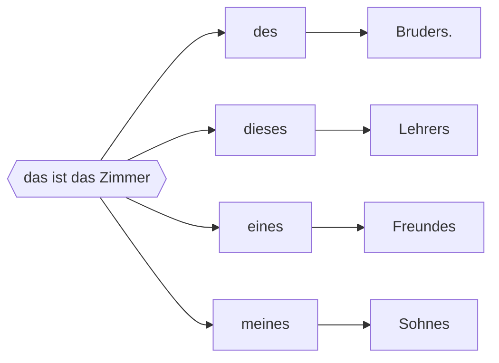
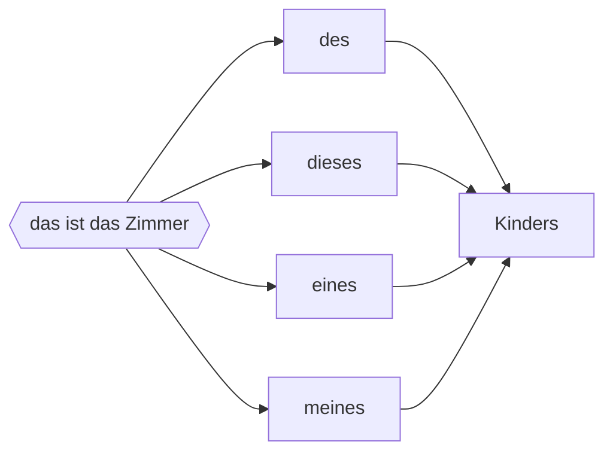
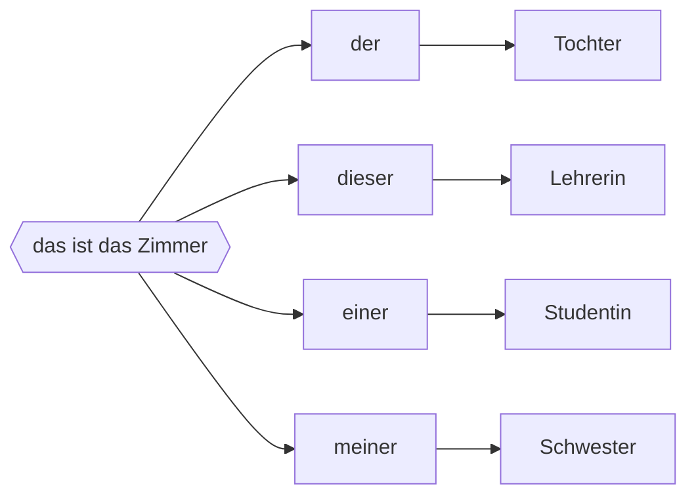
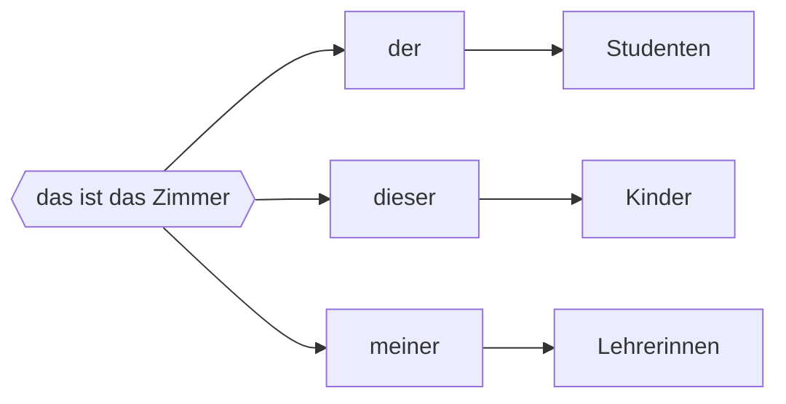

## 🔰Vokabeln
###  Vorübung

| DEUTSCH               | ENGLISCH       | INFO              |
| --------------------- | -------------- | ----------------- |
| wenn                  | conj.if,when   |                   |
| dies und das         | this and that  |                   |
| an/schauen            | look at ,watch | +Akku.            |
| das Ufer,-            | shore,bank     |                   |
| der Engländer,-       | English        |                   |
| der Ausländer,-       | foreigner      |                   |
| dorthin               | to there       |                   |
| wegen                 | because of     | +Gen.             |
| die  Aussicht,-en      | prospect,view  | #⚠️Plural                   |
| die  Skyline,-s        | skyline        |                   |
| spitze                | great          | Umgangssprachlich |
| das Schiff,-e         | ship           | #⚠️Plural         |
| der Wolkenkratzer,-   | skycraper      |                   |
| die  Kolonialzeit,-en  | colony period  |                   |
| die  Bluse,-n          | blouse         |                   |
| der Rock,Röcke        | skirt          |                   |
| elegant               | adj. elegant   |                   |
| der Enkel,-           | grandson       |                   |
| die  Enkelin,-nen      | granddaughter  |                   |
| das Enkelkind,-er     | grandchild     |                   |
| die  Klamotte,-n       | clobber        |                   |
| verschieden           | adj,different  | =unterschiedlich  |
| das Kleidungsstück,-e |                |                   |

> [!tip]- Unterschieden von *Klamotte* und *Kleidungstücke* 
> "Kleidung" und "Klamotten" sind im Grunde Synonyme für "Bekleidung". Es gibt jedoch einige Unterschiede in der Verwendung und Konnotation dieser Wörter.
> "Kleidung" wird normalerweise verwendet, um die allgemeine Kategorie von Kleidungsstücken zu beschreiben, wie Hosen, Hemden, Kleider, Jacken usw. Es ist ein formellerer Ausdruck und wird in der Regel in professionellen oder förmlichen Kontexten verwendet.
> "Klamotten" hingegen ist ein umgangssprachlicher Ausdruck und wird oft verwendet, um auf Kleidung im Allgemeinen zu verweisen, insbesondere auf Alltagskleidung oder Freizeitkleidung. Es kann auch eine leicht abwertende Konnotation haben, je nach Kontext.
> In der Umgangssprache wird "Klamotten" oft als Synonym für "Kleidung" verwendet, aber in formelleren Kontexten wird es selten verwendet. In der Regel verwendet man stattdessen den Begriff "Kleidung".

![[006 L1 Vokabeln von Text 1.mp3]]

_____
### Text 2

| DEUTSCH                          | ENGLISCH                 | INFO           |
| -------------------------------- | ------------------------ | -------------- |
| ein paarmal                      | several times            |                |
| regnen                           | to rain                  |                |
| das Gewitter,-                   | storm,thunderstorm       |                |
| der Blitz,-e                     | lightning    ⚡️         |                |
| der Donner                       | thunder 🌩️               |                |
| der Schnee                       | snow  ❄️                 |                |
| schneien                         | to snow   ❄️             |                |
| während                           | during                   | +Gen.          |
| sonnig                           | sunny ☀️                 |                |
| die  Wolke,-n                     | cloud ☁️                 |                |
| der Himmel                       | sky 🌌                   |                |
| scheinen                         | shine                    |                |
| der Cousin,-s                    | cousin                   | \[ku\'zɛ̃:\]   |
| die  TU                           | =Technische Universität  |                |
| zu Besuch kommen                 | drop by                  |                |
| stören                           | to disturb, disrupt      |                |
| der Job,-s                       | part-time job            |                |
| das Dorf,Dörfe                   | village                  | #⚠️Plural      |
| der/die  Verwandte                | relative                 | Dekl. wie Adj. |
| treffen,triff,traf,hat getroffen | to meet                  |                |
| der Aufsatz,-sätze               | essay                    |                |
| bestimmt                         | adj.&adv. determined(ly) |                |
| beantworten                      | to reply                 |                |
| der Süd/Süden                    | south                         |                |
![[007 L1 Vokabeln von Text 2.mp3]]

> [!tip] am Himmel 

_______
### Text 3

| DEUTSCH                                 | ENGLISCH                  | INFO      |
| --------------------------------------- | ------------------------- | --------- |
| der Reiseleiter,-                       | tour guide                |           |
| die  Reiseleiterin,-nen                  |                           |           |
| die  Dame,-n                             | lady                      |           |
| der Hauptbahnhof,-höfe                  | main train station        |           |
| das Zentrum,Zentren                     | center                    |           |
| das Stadtzentrum,Stadtzentren           | city center               |           |
| die  Olympi<u>a</u>de,-n                 | Olympics                  |           |
| der Turm,Türme                          | tower                     |           |
| der Fernsehenturm,-türme                | television tower          |           |
| die  Hauptstadt,-städte                  | capital                   |           |
| das Bundesland,-länder                  | state                     |           |
| rund                                    | adj. around,approximate   |           |
| der Einwohner,-                         | citizen                   |           |
| das Ausland                             | foreign countries         |           |
| järlich                                 | yearly                    |           |
| der Besucher,-                          | visitor                   |           |
| die  Messe,-n                            | fair,exhibition           |           |
| das Oktoberfest                         |                           |           |
| der Kilometer                           | kilometer                 |           |
| familiär                                | adj. family               |           |
| das Hertz,Hertzens,Hertzen              | heart                     |           |
| das Hauptproblem,-e                     | main problem              |           |
| der Verkehr                             | traffic                   |           |
| die  Kreuzung,-en                        | crossing,junction         |           |
| der Verkehrsweg,-e                      | route, traffic route      |           |
| der Autofahrer,-                        | car driver                |           |
| die  Ringstraße,-n                       | ring road                 |           |
| der Stadtteil,-e                        | district                  |           |
| der Künstler,-                          | artist                    |           |
| ab/biegen,biegt ab,bog ab,hat abgebogen | turn                      | +Dir.     |
| die  Kunst,Künste                        | art                       | #⚠️Plural |
| das Rathaus,-häuser                     | city hall,town hall       |           |
| die  Besichtigung,-en                    | visit                     |           |
| die  Sehenswürdigkeit,-en                | (tourist)sight,attraction |           |
| der Sparziergang,-gänge                 | walk, stroll              |           |
| die  Reisegruppe,-n                      | tourist group             |           |
| die  Abfahrt,-en                         | departure                 |           |
| der Glockenturm,-türme                  | clock tower               |           |
| das Grab,Gräber                         | tomb 🪦                   |           |
![[008 L1 Vokabeln von Text 3.mp3]]

___

### Wörter

| DEUTSCH                       | ENGLISCH        | INFO      |
| ----------------------------- | --------------- | --------- |
| die  Enkeltochter,-töchter     | granddaughter   |           |
| der Enkelsohn,-söhne          | grandson        |           |
| die  Cousine,-n                | female cousin   |           |
| die  Nichte,-n                 | niece           |           |
| der Neffe,-n                  | nephew          | #⚠️Plural |
| der Ehepartner,-              | spouse          |           |
| die  Schwiegereltern,Pl.       | parents-in-law  |           |
| die  Schwiegermutter,-mütter   | mother-in-law   |           |
| der Schwiegervater,-väter     | father-in-law   |           |
| der Schwager,-                | brother-in-law  |           |
| die  Schwägerin,-nen           | sister-in-law   |           |
| der Schwiegersohn,-söhne      | son-in-law      |           |
| die  Schwiegertochter,-töchter | daughter-in-law |           |
| die  Oma,-s                    | grandma         |           |
| der Opa,-s                    | grandpa         |           |
| der Papa,-s                   | papa            |           |
| die  Mama,-s                   | mama            |           |
| die  Himmelsrichtung,-en       |                 |           |
| der Nord/Norden               |                 |           |
| der West/Westen               |                 |           |
| der Ost/Osten                 |                 |           |
![[009 L1 Vokabeln von Woerter.mp3]]
___

> [!tip] Tipp
> die Namen der Länder mit der Endung -ei sind feminin.
> Zum Beispiel : die Mongolei,die Türkei

## 📄Texte

### T1 : Yang Fang kommt schick aus den Ferien zurück
- Anna: Na, Yang Fang, wie waren die Winterferien?
- Yang Fang: Zu kurz. <mark style="background: #ABF7F7A6;">Immer wenn ich in Shanghai bin, will ich gar nicht mehr weg.</mark>
- Anna: Was hast du denn gemacht?
- Yang Fang: Ach dies und das. Wenn das Wetter schön war, bin ich in der Stadt spazieren gegangen, habe Geschäfte angeschaut, auch etwas gekauft. Abends war ich oft am Waitan. Manchmal ist Li Tao mitgekommen.
- Anna: Waitan?
- Yang Fang: Ja, das Ufer des Huangpu mit den Gebäuden der Engländer.
- Anna: Ach, der Bund.
- Yang Fang: Stimmt! Die Ausländer nennen die Uferstraße Bund. Viele gehen abends dorthin wegen der Aussicht auf Pudong.
- Anna: Ja, ich habe Fotos geschen. Die Skyline von Pudong ist spitze.
- Yang Fang: Besonders wenn man mit einem Schiff am Abend auf dem Huangpu fahrt. An dem einen Ufer stehen Wolkenkratzer, an dem anderen sind die Gebäude aus der Kolonialzeit. - Aber schau, da
- kommt ia auch Thomas. Hallo, Tom!
- Thomas: Guton Tag, Yang Fang. Na, wieder zurück? Oh, du sichst aber schick aus. Mantel, Pullover, Bluse, Rock und Schuhe, alles neu und sehr elegant!
- Yang Fang: Danke. Shanghaierinnen sind eben schick. Zum Frühlingsfest bekomme ich immer etwas Geld von meinen Eltern und besonders von meinen Großeltern. Die haben nur mich als Enkelkind. Da bin ich gleich losgegangen und habe mir Klamotten gekauft.

![[001 L1 T1 Yang Fang kommt schick aus den Ferien zurück.mp3]]

###### Umgangssprache

| Formal                   | ugs.       |
| ------------------------ | ---------- |
| elegant,sehr schön       | schick     |
| einiges,Verschiendenes   | etwas      |
| wunderbar,sehr schön     | toll,super |
| Kleidung,Kleidungsstücke | Klamotten  |
_____
### T2 : Li Tao war am Computer

- Thomas: Seht mal, Li Tao ist auch schon wieder da.
- Anna: Hallo, Li Tao, wie war's in den Ferien?
- Li Tao: Hat euch das nicht schon Yang Fang erzählt? Wir sind ein paarmal zusammen in der Stadt gewesen, wenn es nicht geregnet hat.Aber wir hatten oft Regen und auch ein Gewitter, so richtig mit Blitz und Donner. Wie war in Beijing das Wetter?
- Thomas: Regen hatten wir natürlich nicht, es war viel zu kalt, aber Schnee.Zwei- oder dreimal hat es geschneit. Während der Feiertage war aber das Wetter sehr schön. Es war sonnig und keine Wolke war <mark style="background: #D2B3FFA6;">am Himmel</mark>. Da bin ich <mark style="background: #D2B3FFA6;">Schlittschuh gelaufen</mark>.

> [!note] Notizen
> am Himmel 🌌 
> Schlittschuh laufen : go skiing ⛷️ 

- Yang Fang: Li Tao ist auch zu Hause geblieben, wenn die Sonne geschienen hat, - wegen seiner Computerspiele.
- Anna: Findest du die so interessant?
- Li Tao: <mark style="background: #D2B3FFA6;">Das kommt auf die Spiele an.</mark> Mein Cousin studiert Informatik an der TU Shanghai. Er bringt immer Computerspiele mit, wenn er zu Besuch kommt. Die sind wirklich spitze, interessant und intelligent.
- Thomas: Der Mensch ist nur dann ganz Mensch, wenn er spielt! Das hat Schiller gesagt. Mich stört es, wenn auf meinem Computer Spiele sind. <mark style="background: #ABF7F7A6;">Wenn ich damit mal anfange, kann ich nicht mehr aufhören.</mark>
- Li Tao: Ich schon. Aber meistens arbeite ich ja am Computer.- Wenn es geht, studiere ich noch Informatik nach der Germanistik. Da bekommt man leichter einen Job.
- Anna: Hattet ihr eigentlich viel Besuch während des Frühlingsfests?
- Li Tao: Mein Cousin war mit seinen Eltern fast fünf Tage bei uns. Mein Onkel und meine Tante leben in einem Dorf bei Shaoxing. Und dann haben wir natürlich unsere Verwandten in Shanghai getroffen.
- Yang Fang: Ihr wisst ja, das Frühlingsfest ist ein Familienfest.
- Anna: Das weiß ich, aber sonst weiß ich nur sehr wenig über das Frühlingsfest in einer chinesischen Familie.
- Yang Fang: Du, wir müssen gerade einen Aufsatz für den Deutschunterricht schreiben. Das Thema ist: Das Frühlingsfest. Wenn ihr Zeit habt, könnt ihr unsere Aufsätze mal lesen. Vielleicht auch korrigieren?
- Thomas: Das machen wir gern.
- Anna: Li Taos Frühlingsfestaufsatz über Computerspiele wird bestimmt sehr interessant.

![[003 L1 T2 Li Tao war am Computer..mp3]]

> [!note] Wortshatz
> **ein paarmal** : mehr als zweimal, aber nicht sehr oft.
> - Wir waren ein paarmal da, aber er war nicht zu Hause
> -  Ich kenne Herr Meier eigentlich nicht sehr gut. Wir waren nur ein paarmal zusammen bei einer Sitzung.
> 
> **zu Besuch kommen/sein** : 
> - Nimm doch deine Freunde mit,wenn du nächstes Mal zu besuch kommst.
> - Wir waren oft beim Familie Müller zu Besuch.
>
> **stören :**
> - Die Musik ist zu laut.Du störst doch deinen Bruder.
> - Entschuldigung. Darf ich mal stören?
> - Störe ich dich , wenn ich hier fernsehe?
> - Er kommt immer zu spät. Das stört mich.

_____
### T3 : Eine Reiseleiterin spricht über München

Wir beginnen unsere Stadtrundfahrt hier am Hauptbahnhof. Wir fahren heute Vormittag ins Stadtzentrum. Heute Nachmittag zeige ich Ihnen den Olympiapark. Dort war 1972 die Olympiade und dort steht auch der Fernsehturm. Im Restaurant des Fernsehturms trinken wir Kaffee.

Zuerst möchte ich Ihnen aber etwas über München erzählen. München ist die Hauptstadt des Bundeslandes Bayern und eine Weltstadt. Rund 300 000 der etwa 1,42 Millionen Einwohner sind Ausländer. Das sind 21%. An den neun Universitäten und Hochschulen Münchens studieren 100 000 Studenten.12% von ihnen sind aus dem Ausland. Jährlich hat die Stadt fast 5 Millionen Besucher: Touristen, Messegäste und natürlich die Freunde des Oktoberfests.Sie kommen mit dem Auto, der Bahn oder dem Flugzeug. Der Flughafen von München, 29 Kilometer nordöstlich vom Zentrum, verbindet durch ca. 400 000 Flüge pro Jahr München mit der ganzen Welt. Aber die Stadt ist familiär geblieben. Einige Leute nennen München „Millionendorf", die Münchner nennen ihre Stadt gern „Weltstadt mit Herz".

Natürlich hat München auch Probleme. Ein Hauptproblem ist der Verkehr.München liegt an der Kreuzung der Verkehrswege von Westeuropa nach Südosteuropa und von Nordeuropa nach Italien. Besonders während der laubszeit sind die Autofahrer froh, wenn die Autobahnen und Ringstraßen Münchens hinter ihnen liegen.Wir sind jetzt auf der Ludwigstraße. Sie führt nach Schwabing. Das ist der Stadtteil der Künstler und Studenten.

Wir biegen jetzt nach rechts ab. Das Gebäude vor uns ist das Haus der Kunst.Dahinter können Sie die Bäume eines Parks sehen. Das ist der Englische Garten. Nun fahren wir zurück nach Süden zum Zentrum. Vor uns sind die Türme der Frauenkirche. Die wollen wir jetzt gleich besichtigen. Dann gehen wir zu Fuß zum Alten Rathaus und zum Hofbräuhaus.

Sie kennen das Hofbräuhaus noch nicht? Dieses Gebäude ist wichtig! Da können Sie das weltberühmte Münchner Bier trinken. Denn München ist auch die Stadt des Biers.
![[004 L1 T3 Eine Reiseleiterin spricht über München..mp3]]

____
## 📖Wörter
### G1 : Verwandte

![[verwandte1.jpg]]
![[verwandte2.jpg]]
_____
### G2 : Himmelsrichtungen
![[himmelsrichtung.jpeg]]

| Nomen       | Adjektive |
| ----------- | --------- |
| Süd/Süden   | südlich   |
| Nord/Norden | nördlich  |
| Ost/Osten   | östlich   |
| West/Westen | westlich  |

## 🚦Grammatik
### 1.Der Relativsatz mit *wenn*

- Hallo, Manfred!Hast du morgen etwas vor?
- Ja, am Vormittag will ich arbeiten,aber am Nachmittag...?Ich weiß nicht, vielleicht gehe ich spazieren, <mark style="background: #ADCCFFA6;">wenn das Wetter schön bleibt.</mark>
- Ich besuche am Nachmittag eine Fotoausstellung. Komm doch mit, <mark style="background: #ABF7F7A6;">wenn du nichts wichtiges vorhast.</mark>
- Gut wann fahren wir?
- <mark style="background: #FF5582A6;">Wenn es dir passt</mark>, gleich nach dem Essen, so um eins.
- O.k. Und <mark style="background: #CACFD9A6;">wenn ich doch keine Zeit habe</mark> ,rufe ich dich an.

##### 1. Satzgefüge : Hauptsatz + Nebensatz

| Hauptsatz                 | Nebensatz                     |
| ------------------------- | ----------------------------- |
| Wir machen einen Ausflug, | <mark style="background: #FFB86CA6;">wenn</mark> das Wetter schön bleibt. |
| Ich rufe dich gleich an,  | <mark style="background: #FFB86CA6;">wenn</mark> ich zu Hause angekommen bin.                              |

| Nebensatz                         | Hauptsatz                 |
| --------------------------------- | ------------------------- |
| <mark style="background: #D2B3FFA6;">Wenn</mark> das Wetter schön bleibt      | machen wir einen Ausflug. |
| <mark style="background: #D2B3FFA6;">Wenn</mark> ich zu hause angekommen bin, | rufe ich dich gleich an.                          |

##### 2. Funktion des *wenn*-Nebensatzes

|                            | V1    |                   | V2         |
| -------------------------- | ----- | ----------------- | ---------- |
| Heute                      | fahre | ich in die Stadt. |            |
| Bei schönem Wetter         | gehe  | ich               | spazieren. |
| Wenn das Wetter schön ist, | gehe  | ich               | spazieren  |

##### 3.Satzzeichen im Satzgefüge

|             | Hauptsatz                             | Nebensatz                              |
| ----------- | ------------------------------------- | -------------------------------------- |
| Imperativ   | Komm doch bitte an Wochenende zu uns, | wenn du Zeit hast<mark style="background: #BBFABBA6;">! </mark>                    |
| Fragesatz   | Willst du mitkommen,                  | wenn wir morgen abends ins Kino gehen<mark style="background: #BBFABBA6;">?</mark>|
| Aussagesatz | Ich rufe dich an,                     | wenn ich mitkommen kann<mark style="background: #BBFABBA6;">.</mark>                                       |

### G2 : der Genitiv 
###### 1. Nomen und Artikelwörter im Genitiv
1. Maskulin

2. Neutral

3. Feminin

4. Plural

___
Das Genitivattribut antwortet auf die Frage *wissen*.
Im Genitiv Singular haben die <mark style="background: #FFB86CA6;">meisten</mark> maskulinen und neutralen Nomen die Engdung *-s* oder *-es* .

*-es* steht :
+ bei Nomen mit dem Endbuchstaben *-s,-ß,-z,-x,-tz* 
> [!example] zum Beispiel
> der Platz -> des Platzes ; das Kaufhaus -> des Kaufhauses
> das Suffix -> des Suffixes ; der Prozess -> des Prozesses

- im Allgemeinen bei <mark style="background: #FF5582A6;">einsilbigen</mark> Nomen 
> [!example] zum Beispiel
> der Mann -> des Mannes ; das Kind -> des Kindes
> der Freund -> des Freundes ; das Buch -> des Buches

___
##### 2. Personennamen im Genitiv

- Wang Lan**s** Bruder studiert in Deutschland.
- Professor Li**s** Tochter will nach Bayern fahren.
- Herr**n** Bode**s** Sohn Jonas studiert in München Germanistik.
- Aber Jonas' Schwester Maria und ihr Freud Max studieren zusammen in Hamburg.
- Maria**s** Fach ist Medizin, aber Max' Fach ist Infomatik.

1. Namen haben in der Regel die Genitivendung *-s*  . Bei Namen auf *-s,-ß,-z,-x* (z.B. Hans,Groß,Schulz,Alex) wird der Genitiv durch Apostroph gekennzeichnet.

2. In der gesprochen Sprache setzt sich jedoch immer mehr *von* mit Dativ durch.

Jonas' Schwester -> die Schwester von Jesus
Heinz' Adresse -> die Adresse von Heinz
Marx' Heimatstadt -> die Heimatstadt von Marx

##### 3. Ländernamen im Genitiv

| Nominativ   | Genitiv      |
| ----------- | ------------ |
| Frankreich  | -> Frankreichs  |
| Österreich  | -> Österreichs  |
| China       | -> Chinas       |
| Deutschland | -> Deutschlands |
| England     | -> Englands     |

| Nominativ                      | Genitiv                           |
| ------------------------------ | --------------------------------- |
| die Schweiz                    | -> der Schweiz                    |
| die Bundesrepublik Deutschland | -> der Bundesrepublic Deutschland |
| die Volksrepublic China        | -> der Volksrepublic China        |
| die Mongolei                   | -> der Mon                        | 

| Nominativ             | Genitiv         |
| --------------------- | --------------- |
| die USA (Pl.)         | der USA         |
| die Niederlande (Pl.) | der Niederlande | 
##### 4.Genitivendungen bei Nomen der *n*-Deklination

| Nom.          | Akku.           | Dat.            | Gen.            | Pl.Nom.         |
| ------------- | --------------- | --------------- | --------------- | --------------- |
| der Student   | den Studenten   | dem Studenten   | des Studenten   | die Studenten   |
| der Automat   | den Automaten   | dem Automaten   | des Automaten   | die Automaten   |
| der Germanist | den Germanisten | dem Germanisten | des Germanisten | die Germanisten |
| der Prophet   | den Propheten   | dem Propheten   | des Propheten   | die Propheten   |
| der Tourist   | den Touristen   | dem Touristen   | des Touristen   | die Touristen   |
| der Christ    | den Christen    | dem Christen    | des Christen    | die Christen    |
| der Prinz     | den Prinzen     | dem Prinzen     | des Prinzen     | die Prinzen     |
| der Mensch    | den Menschen    | dem Menschen    | des Menschen    | die Menschen    |
| __            | __              | __              | __              | __              |
| der Junge     | den Jungen      | dem Jungen      | des Jungen      | die Jungen      |
| der Kollege   | den Kollegen    | dem Kollegen    | des Kollegen    | die Kollegen    |
| der Kunde     | den Kunden      | dem Kunden      | des Kunden      | die Kunden      |
| __            | __              | __              | __              | __              |
| der Chinese   | den Chinesen    | dem Chinesen    | des Chinesen    | die Chinesen    |
| der Jude      | den Juden       | dem Juden       | des Juden       | die Juden       |

> [!warning] Achtung

|           |             |             | Gen.         | Pl.        |
| --------- | ----------- | ----------- | ------------ | ---------- |
| der Herr  | den Herrn   | dem Herrn   | des Herrn    | <mark style="background: #FFB8EBA6;">die Herren</mark> |
| der Name  | den Name    | dem Namen   | <mark style="background: #FFB8EBA6;">des Namens </mark>  | die Namen  |
| <mark style="background: #FF5582A6;">dad Hertz </mark>| den Hertzen | dem Hertzen | <mark style="background: #FFB8EBA6;">des Hertzens</mark> | die hertzen           |

### G3 : Präpositionen mit dem Dativ : *während* und *wegen*
- Hallo, Inge!
- Tag, Maria! Wart ihr im Urlaub?
- Ja, wir sind eine Woche nach Spanien geflogen. Alles war schön. Nur das Wetter war nicht so toll. Während des Urlaubs hat es ziemlich viel geregnet. Macht ihr auch bald Urlaub?😆
- In diesem Sommer fahren wir nicht mehr weg, wegen meiner Mutter. Du weißt doch, es geht ihr seit einiger Zeit nicht so gut.
- Ach ja🤨 , ich besuche sie am Wochenende mal.
- Das ist nett.  🙂

Funktion der Präpositionalgruppen mit während und wegen:

| Präpositionalgruppen im Satz                                         | auf die Frage | Funktion       |
| -------------------------------------------------------------------- | ------------- | -------------- |
| Während seines Studiums hat er schon für unsere Zeitung geschrieben. | *wann?*       | Temporalangabe |
| Wegen des Wetters mussten wir an Wochenende zu Hause bleiben.        | _warum?_      | Kausalangabe               |

## 🧭 Übung
###  Namen der Länder🌏

#####  Asien und Australien 🌏

|     |              |     |             |
| --- | ------------ | --- | ----------- |
| 🇨🇳  | China        | 🇸🇬  | Singapore   |
| 🇯🇵  | Japan        | 🇮🇷  | der Iran    |
| 🇲🇳  | die  Mongolei | 🇮🇶  | der Iraq    |
| 🇻🇳  | Vietnam      | 🇱🇧  | der Libanon |
| 🇹🇼  | Taiwan       | 🇸🇩  | der Sudan   |
| 🇰🇷  | Südkorea     |  🇵🇭   | die  Philippinen(Pl.)           |
| 🇮🇩  | Indonesien   |     |             |

##### Europa 🌍 

|     |                                                     |     |                                            |
| --- | --------------------------------------------------- | --- | ------------------------------------------ |
| 🇫🇷  | Frankreich                                          | 🇹🇷  | die  Türkei   |
| 🇮🇪  | Irland                                              | 🇺🇦  | die  Ukraine  |
| 🇵🇱  | Polen                                               | 🇻🇦  | der Vatikan |
| 🇳🇴  | Norwegen                                            | 🇫🇮  | Finnland                                           |
| 🇮🇹  | Italien                                             |     |                                            |
| 🇳🇱  | die  Niederlande (Pl.) |     |                                            |
| 🇩🇪  | Deutschland                                         |     |                                            |
| 🇪🇸  | Spanien                                             |     |                                            |
| 🇬🇷  | Geriechenland                                       |     |                                            |
| 🇨🇭  | die  Schweiz           |     |                                            |
| 🇩🇰  | Dänemark                                            |     |                                            |
| 🇸🇪  | Schweden                                            |     |                                            |
| 🇨🇿  | Tschechien                                          |     |                                            |

##### Amerika und Afrika

|     |               |
| --- | ------------- |
| 🇺🇸  | die USA (Pl.) |
| 🇨🇦  | Kanada        |
| 🇲🇽  | Mexiko        |

### Einwohner von Ländern und Erdteilen 🗺️ 

###### 1. Schwache Deklination (n-)

| Land            | Länder                                                     |
| --------------- | ---------------------------------------------------------- |
| 🇬🇧 der Brite    | des Briten                                                 |
| 🇨🇳 der Chinese  | des Chinesen                                               |
| 🇩🇰 der Däne     | des Dänen                                                  |
| 🇫🇮 der Finne    | des Finnen                                                 |
| 🇫🇷 der Franzose | <mark style="background: #D2B3FFA6;">des Franzossen</mark> |
| 🇬🇷 der Grieche  | des Greichen                                               |
| 🇵🇱 der Pole     | des Polen                                                  |
| 🇷🇺 der Russe    | des Russen                                                 |
| 🇹🇷 der Türke    | des Türken                                                 |
| 🌏 der Asiat    | des Asiaten                                                |

###### 2. Starke Deklination

| Länder                 | Deklination       |
| ---------------------- | ----------------- |
| 🇸🇦 der Araber          | des Arabers       |
| 🏴󠁧󠁢󠁥󠁮󠁧󠁿 der Engländer | des Engländers    |
| 🇮🇳 der Inder           | des Inders        |
| 🇯🇵 der Japaner         | des Japaners      |
| 🇮🇹 der Italiner        | des Italiners     |
| 🇦🇹 der Österreicher    | des Österreichers |
| 🇨🇭 der Schweizer       | des Schweizers    |
| 🇹🇭 der Thailänder      | des Thailänders   |

| Erdteile       |                 |
| -------------- | --------------- |
| der Amerikaner | des Amerikaners |
| der Afrikaner  | des Afrikaners  |
| der Australier | des Australier  |
| der Europäer   | des Europäers   |

###### 3. Ausnahmen

> [!warning] der Deutsche
> der Deutsche wird wie ein Adjektik dekliniert
> maskulin : der Deutsche/ein Deutsche/des Deutshen
> feminin : die Deutsche/eine Deutsche
> Pl. die Deutschen / Deutsche

###### 4. Anmerkung

Abgesehen von die Deutsche haben die Bezeichnung von Frauen immer die Endung *-in*
z.B.
die Chinesin,die die Russin, die Spanierin , die Eurpäerin,die Französin 
