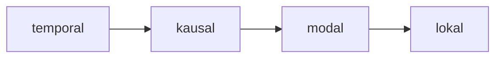

## Text 1

### Vokabeln

| DEUTSCH                                                   | ENGLISCH                | INFO        |
| --------------------------------------------------------- | ----------------------- | ----------- |
| das Stichwort,-e/wörter      | keuword                 |             |
| verändern                                                 | to change               | +Akku./sich |
| alltäglich                                                | adj.everyday            |             |
| der Vorgang,-gänge           | process,procedure       |             |
| vermeiden                                                 | to avoid                | +Akku.      |
| kreativ                                                   | adj. creative           |             |
| sorgfältig                                                | careful                 |             |
| die  Lernhilfe,-n            | study helper            |             |
| die  Kommunikation           | communication           |             |
| manche                                                    | some,many a             |             |
| das Protokoll,-e             | protocol,log            |             |
| die  Zusammenfassung,-en     | summary                 |             |
| daher                                                     | adv.therefore,thus      |             |
| der Gewinnpunkt,-e           | score                   |             |
| das Kartenspiel,-e           | card game               |             |
| der Vorteil,-e               | advantage               |             |
| die  Weisheit,-en            | wisdom,lore             |             |
| die  Spur,-en                | track,trace,hint,trail  |             |
| innerlich                                                 | adj. inner,internal     |             |
| der Klang,Klänge             | sound                   |             |
| die  Bewegung,-en            | activity                |             |
| lateinisch                                                | latino                  |             |
| die  Schrift,-en             | font,writing            |             |
| aktivieren                                                | activate                | +Akku.      |
| die  Zeichensetzung          | punctuation             |             |
| mit/schreiben,schreibt mit,schrieb mit,hat mitgeschrieben | to make notes,take down | +Akku.      |
| schwarz auf weiß                                          | black on the white      |             |
| besitzen                                                  | to occupy,fill          | +Akku.      |
| getrost                                                   | adj. confident          |             |

![[086 L10 Vokabeln-T1.mp3]]

### Text:Wer schreibt, der bleibt

Hier ein paar erste Tipps:
-  Mit dem Einfachen beginnen und auch das Einfachste immer wieder üben: Das Schreiben von Wortnetzen, Stichworten und Redemitteln.
- Texte abschreiben und dabei verändern: z.B. die Person, den Beruf, die Zeit wechseln.
- Über alltägliche Vorgänge berichten.
- Komplizierte Gedanken vermeiden und als Anfänger nicht zu kreativ sein wollen.
- Langsam schreiben und das Geschriebene sorgfältig korrigieren.

Das wirkliche Schreiben ist aber keine Lernhilfe oder Übungs-form, sondern eine Kommunikationsform. SMS, E-Mails oder Briefe schreibt man täglich, manche führen ein Tagebuch und Studenten müssen Berichte, Protokolle, Zusammenfassungen und wissenschaftliche Arbeiten schreiben. Daher heißt die Frage beim Sprachenlernen nicht nur „Was kann ich beim Schreiben lernen?" sondern vor allem „Wie kann ich schreiben lernen?"

Wer die Gewinnpunkte beim Kartenspiel notiert, der hat Vor-teile, glauben die Spieler und sie haben daraus das Sprichwort gemacht: Wer schreibt, der bleibt. Diese Kartenspie-lerweisheit <mark style="background: #ABF7F7A6;">gilt </mark>auch für Deutschlerner.Wer schreibt, der bleibt der neuen Sprache auf der Spur. Und auch was man schreibt, das bleibt - es bleibt besser im Gedächtnis.

> [!note] gelten
> gelten -> gilt - > galt -> hat gegolten

Wenn man Schreiben, Lesen und Hören vergleicht, so sind beim Schreiben viel mehr Sinne aktiv, <mark style="background: #BBFABBA6;">es öffnen sich mehr Türen zum Gedächtnis</mark>: Man sieht die Wörter und Sätze, man hört innerlich ihren Klang und man spricht innerlich mit. Auch die Bewegung der Hand ist wichtig. Nach Meinung von Lernpsychologen fördert diese Bewegung die Gedächtnisleistung besonders, wenn Deutschlerner in ihrer Muttersprache nicht die lateinische Schrift benutzen.

Doch Schreiben aktiviert nicht nur l das Gedächtnis, es hilft auch bei vielen konkreten Lernschwierigkeiten: bei Rechtschreibung, Zeichensetzung, Grammatik, beim Erkennen von Text-sorten und Unterschieden im Sprach-gebrauch. Ferner gehört Schreiben zu einem effizienten Arbeitsstil. Man ist im Unterricht konzentrierter, wenn man mitschreibt, man versteht mehr, wenn man sich zu Lese- und Hörtexten Stichworte notiert, und man lernt bewusster, wenn man ein Lerntagebuch führt. , Was man schwarz auf weiß besitzt, kann man getrost nach Hause tragen.", heißt es in Goethes Faust.

![[083 L10 T1 Wer schreibt,der bleibt..mp3]]

### Zusätzlicher Wortschatz

| DEUTSCH           | ENGLISCH                    | INFO    |
| ----------------- | --------------------------- | ------- |
| die Kontrolle, -n | check, control              |         |
| kontrollieren     | to check, control           | + Akku. |
| überflüssig       | adj. superfluous, redundant |         |
| anhand            | prep. by means of           | + Gen.  |
| zusätzlich        | adj. additional             |         |

## Text 2

### Vokabeln

| DEUTSCH                                                 | ENGLISCH                        | INFO          |
| ------------------------------------------------------- | ------------------------------- | ------------- |
| jahrelang                                               | adj. years long                 |               |
| speichern                                               | to store,save,retain            | +Akku.        |
| ein/prägen sich(Dat.)+Akku.                             | to memorize                     |               |
| allmählich                                              | adj.&adv. gradually,progressive |               |
| das Opfer,-                | victim                          |               |
| die  Korrektur,-en         | correction                      |               |
| achten                                                  | to notice                       | auf + Akku.   |
| folgend                                                 | adj. the following              |               |
| die  Schilderung,-en       | description,depiction           |               |
| logisch                                                 | adj. logical                    |               |
| die  Verbindung,-en        | connection                      |               |
| die  Konjunktion,-en       | conjuction                      |               |
| der Hauptsatz,-sätze       |                                 |               |
| der Nebensatz,-sätze       |                                 |               |
| die  Satzgliedposition,-en |                                 |               |
| der Aussagesatz,-sätze     |                                 |               |
| der Fragesatz,-sätze       |                                 |               |
| die  Satzklammer           |                                 |               |
| die  Konjugation,-en       |                                 |               |
| die  Deklination,-en       |                                 |               |
| das Adjektiv,-e            |                                 |               |
| sowieso                                                 | anyway                          |               |
| entdecken                                               | to discover                     | +Akku.        |
| aus/tauschen                                            | to exchange                     | +Akku. +(mit) |
| der Rand,Rände             | edge,border,margin              | #⚠️Plural     |
| der Ausdruck               | expression                      |               |
| die  Häufigkeit            | frequency                       |               |
| ein/schätzen                                            | to estimate                     | +Akku.        |
| die  Analyse,-n            | analyse                         |               |
| die  Ursache,-n            | cause,reason,root               |               |
| die  Flüchtigkeit          | volatility                      |               |
| hartnäckig                                              | adj. stubborn                   |               |
| das Verständnis            | understanding                   |               |
| die  Konzentration         | concentration                   |               |
| riskieren                                               | to risk                         |               |
| zusammen/fassen                                         | to summarize                    | + Akku.       |
| die  Liste, -n             | list                            |               |
| streichen, streicht, strich, hat gestrichen             | to delete                       | +Akku.        |
| fehlerfrei                                              | adj. error-free                 |               |

![[087 L10 Vokabeln-T2.mp3]]

### Text: Aus Fehlern wird man klug

Das Gedächtnis macht selten, was es machen soll. Wichtige Informationen vergisst es und unwichtige Details behält es jahrelang. Sehr gern speichert es auch Fehler. Wenn man das Falsche nicht korrigiert, prägt man es sich allmählich als richtig ein. Auch gute Professoren, Dolmetscher und Übersetzer werden Opfer ihres Fehler-Gedächtnisses und machen das ganze Leben lang immer wieder <mark style="background: #D2B3FFA6;">dasselbe</mark> falsch.

> [!note] dasselbe = the same pron.

Da gerade beim Schreiben das Gedächtnis sehr aktiv ist, muss man hier besonders sorgfältig Falsches korrigieren und versuchen, aus seinen Fehlern zu lernen.

Machen Sie die Korrekturen an Ihren Texten in vier Schritten.

#### Schritt 1 : Die Selbstkorrektur
Lesen Sie Ihren Text fünfmal durch und achten Sie bei jedem Lesen immer nur auf eine der folgenden Fragen:

1. Lesen : Ist Ihre Schilderung oder Argumentation logisch? Achten Sie besonders auf die Verbindung zwischen den Hauptsätzen und zwischen Haupt- und Nebensätzen (Konjunktionen!).
2. Lesen : Stimmen die Satzgliedpositionen in den Sätzen? Achten Sie auf Aussage- und Fragesätze, auf Haupt- und Nebensätze, und auf die Satzklammern.
3. Lesen : Stimmen die Konjugationsformen der Verben?
4. Lesen : Stimmen die Deklinationsformen von Nomen und Adjektiven?
5. Lesen : Stimmen Rechtschreibung und Zeichensetzung?

#### Schritt 2 : Die Partnerkorrektur
Nicht immer ist der Lehrer mit seinem Rotstift da und sagt einem, was richtig und was falsch ist. Aber für das Lernen ist es sowieso viel besser, Fehler selbst zu entdecken. Tauschen Sie mit Mitstudenten Ihre Texte aus und korrigieren Sie sich gegenseitig. Schreiben Sie an den Rand R für Rechtschreib-fehler, Z für Zeichensetzungsfehler, G für Grammatikfehler, St für Fehler in der Satzgliedstellung und A für Ausdrucks- oder Stilfehler. Diskutieren Sie dann die Fehler in der Gruppe. Das macht nicht nur mehr Spaß, man lernt dabei auch aus den Fehlern <mark style="background: #FF5582A6;">anderer</mark> und kann die Häufigkeit bestimmter Fehler besser <mark style="background: #FFB86CA6;">einschätzen</mark>.
 
#### Schritt 3 : Die Fehleranalyse 

Die Häufigkeit der Fehler zeigt Ihnen, wo Sie Schwächen haben und weiter <mark style="background: #D2B3FFA6;">an</mark> Ihrem Deutsch arbeiten müssen. Nicht weniger wichtig sind die Ursache und die <mark style="background: #ADCCFFA6;">Schwere</mark> der Fehler. Fragen Sie sich bei jedem Fehler: Wie ist er entstanden? Wie kann ich ihn vermeiden? Entscheiden Sie dabei, ob es nur ein Flüchtigkeitsfehler ist, ob Sie diesen Fehler immer wieder machen (hartnäckiger Fehler) oder ob Sie ihn gar nicht verstehen (Verständnisproblem).

> [!note] arbeiten an etw. : work on

#### Schritt 4 : Die Gedächtniskorrektur

Die Flüchtigkeitsfehler sind bei Prüfungen schlecht, aber kein Problem des Gedächtnisses. Man kann sie durch Konzentration vermeiden. Doch konzentrieren Sie sich beim Schreiben nicht zu sehr auf mögliche Flüchtigkeitsfehler, riskieren Sie lieber ein paar, sonst denken Sie nur an Wörter und weniger an den ganzen Text. Wenn Sie viel schreiben, <mark style="background: #ADCCFFA6;">verschwinden </mark><mark style="background: #FFF3A3A6;">die meisten Flüchtigkeitsfehler von selbst.</mark>

Hartnäckige Fehler müssen Sie notieren, am besten in Ihrem Lerninspektor.

Fassen Sie diese Fehler <mark style="background: #FF5582A6;">von Zeit zu Zeit</mark> in einer Liste zusammen und <mark style="background: #BBFABBA6;">streichen</mark> Sie die Fehler erst dann aus der Liste, wenn sie auch aus Ihrem Gedächtnis gestrichen sind.

> [!note] 
> von Zeit zu Zeit:from time to time
> verschwinden, verschwindet, verschwand, ist verschwunden : to disappear
> streichen, streicht, strich, ist gestrichen : to delete

Bei Verständnisproblemen müssen Sie in Grammatiken oder Wörterbüchern nachschauen, oder Sie fragen Mitstudenten oder Lehrer. Auch hier sollten Sie sich eine Notiz in Ihrem Lerninspektor machen. So wird Ihr Gedächtnis langsam fehlerfrei.

![[085 L10 T2 Aus Fehlern wird man klug.mp3]]
### Zusätzlicher Wortschatz

| DEUTSCH                                      | ENGLISCH            | INFO   |
| -------------------------------------------- | ------------------- | ------ |
| auf/geben, gibt auf, gab auf, hat aufgegoben | to give up, abandon | +Akku. |
| die Förderung, -en                           | promotion, funding  |        |

## 📖Wörter

### W1 : Die Worttrennung am Zeilenende

## 🚦Grammatik

### G1 : Die Angabe (Zusammenfassung)

1. Lokalangabe : im Restaurant, im Kaufhaus, in der Schule
2. Temporalangabe : am Morgen, heute Abend, im Juli ...
3. Modalangabe : mit seinen Freuden, allein
4. Konditionangabe (oft *wenn*-Sätze) : wenn ....
5. Kausalangabe : wegen des Regens
6. *nicht* als Angabe

### G2 : Die Position der Ergänzungen und Angaben im Mittelfeld 

#### 1. Ergänzungen

|          | V/V1   | Ergänzungen mit Linkstendenz | Angabe                | Ergänzung mit Rechtstendenz | V/V2       |
| -------- | ------ | ---------------------------- | --------------------- | --------------------------- | ---------- |
|          | Wollen | wir                          | heute Abend           | ins Kino                    | gehen?     |
| Ich      | muss   |                              | doch                  | auf die Kleine              | aufpassen. |
|          | Darf   | ich                          | noch ein bisschen     | Fernsehen                   | gucken.    |
|          | Shick  | sie                          | nicht später als neun | ins Bett.                   |            |
| Frau Li  | ist    |                              | seit letzter Woche    | unsere Lehrerin.            |            |
| Sie      | ist    |                              | manchmal nicht so     | nett.                       |            |
| Aber sie | hat    | uns                          | gestern               | ein schönes Märchen         | erzählt.   |

> [!error] Ergänzung mit Linkstendenz : 
> 有前置倾向的补足语
> S A D

> [! warning] Angabe : 自由说明语

> [!tip] Ergänzung mit Rechtstendenz 有后置倾向的补足语
> 有后置倾向的补足语
> Dir, Adj. Sit, N, P

die Tendenz, -en : tendency

#### 2. Angaben

| S      | V/V1 | te-mporal     | ka-sual      | mo-dal          | lo-kal   | V/V2      |
| ------ | ---- | ------------- | ------------ | --------------- | -------- | --------- |
| Elke   | will | nun           | wegen Annika | nur halbtags    | im Büro  | arbeiten. |
| Fabian | muss | heute Abend   |              | mit Annika      | zu Hause | spielen.  |
| Fabian | darf | nächstes Jahr |              | mit dem Fahrrad |          | fahren.   |

Die Reihenfolge der Angaben von links nach rechts : ***te-ka-mo-lo***

> [!example] zum Beispiel
> Wir gingen am Samstag wegen des Regens leider nicht ins Kino.

#### 3. Die Position von ***nicht***

##### ***Satznegation***

| Endstellung von *nicht*                      |                |
| -------------------------------------------- | -------------- |
| Sie liest die Süddeutsche Zeitung ==nicht==. | V + Akku./Dat. |
| Der Kleine aß seine Suppe ==nicht==.         |                |
| Er hilft mir ==nicht==.                      |                |
| Er kommnt heute Abend ==nicht==.             | Temporalangabe |
| Er kommt wegen des Wetters ==nicht==.        | Kausalangabe   |

*Nicht* steht vor dem Satzteil, der eng mit dem Verb verbunden ist.

| Voranstellung von *nicht*               |              |
| --------------------------------------- | ------------ |
| Sie hat die Prüfung ==nicht== geschaft  | V1 + V2      |
| Sie will jetzt ==nicht== heiraten.      |              |
| Sie ist ==nicht== unsere Lehrerin.      | sein + Nomen |
| Sie ist mit uns ==nicht== zufrieden.    | sein + Adj.  |
| Sie geht uns ==nicht== auf die Nerven.  | *Wendungen*  |
| Sein Auto war ==nicht== in Ordnung.     |              |
| Er zieht ==nicht== zu seinem Freund.    | V + Dir.     |
| Er sitzt ==nicht== in der ersten Reihe. | V + Sit.     |
| Er fährt nicht schnell.                 | Modalangabe  |
| Er arbeitet nicht effektiv.             |              |
 
Voranstellung von *nicht* - **Endstellung** auch möglich

| Voranstellung von *nicht* - **Endstellung** auch möglich |       |
| -------------------------------------------------------- | ----- |
| Sie erinnert sich ==nicht== an das Gespräch.             | V + P |
| \=\=Sie erinnert sich an das Gespräch ==nicht==.         |       |
| Er raucht ==nicht== im Büro.                             |       |
| \=\=  Er raucht im Büro ==nicht==.                       |       |
| Sie studiert ==nicht== hier.                             |       |
| \=\= Sie studiert hier ==nicht==.                        |       |
##### Satzteilnegation / Sondernegation
Bei der Unterscheidung von Satznegation und Satzteilnegation <mark style="background: #BBFABBA6;">spielt in der gesprochenen Sprache die Betonung eine wichtige Rolle.</mark>

1. Ich erhole mich in Wien ==nicht==.
2. Ich erhole mich ==nicht== in Wien.
3. Ich erhole mich ==nicht== in Wien, sondern in Paris.
4. ==Nicht== ich erhole mich in Wien, sondern Anna.

##### Position von *nicht* bei unterschiedlichen Angaben.

Er ist gestern wegen des Wetters nicht gern gefahren.
Sie konnte heute bei dem Chaos im Büro nicht gut arbeiten.

### G3 : Zum Gebrauch der Nullartikel

#### 1. Nullartikel bei Namen und Bezeichnungen

1. Personennamen
2. die meisten Länder- und Städtenamen
3. Berufsbezeichnung 
4. Bezeichnungen von Studienfächern
5. häufig nach *als* und *ohne*

#### 2. Nullartikel in bestimmten Kommunikationssituationen (mündlich)

| Situation               | Beispiele                                                                                         |
| ----------------------- | ------------------------------------------------------------------------------------------------- |
| Anrede                  | Herr Professor Bernd .... ; Liebe Kollegen und Kolleginnen                                        |
| Ausrufe                 | Hilfe! ; Vorsicht ; Achtung ; Ruhe bitte                                                          |
| Grußformeln und Wünsche | Frohe Weinachten ; Gute Reise; Guten Tag; Auf Wiedersehen; Herzlichen Glückweunsch zum Geburtstag |

