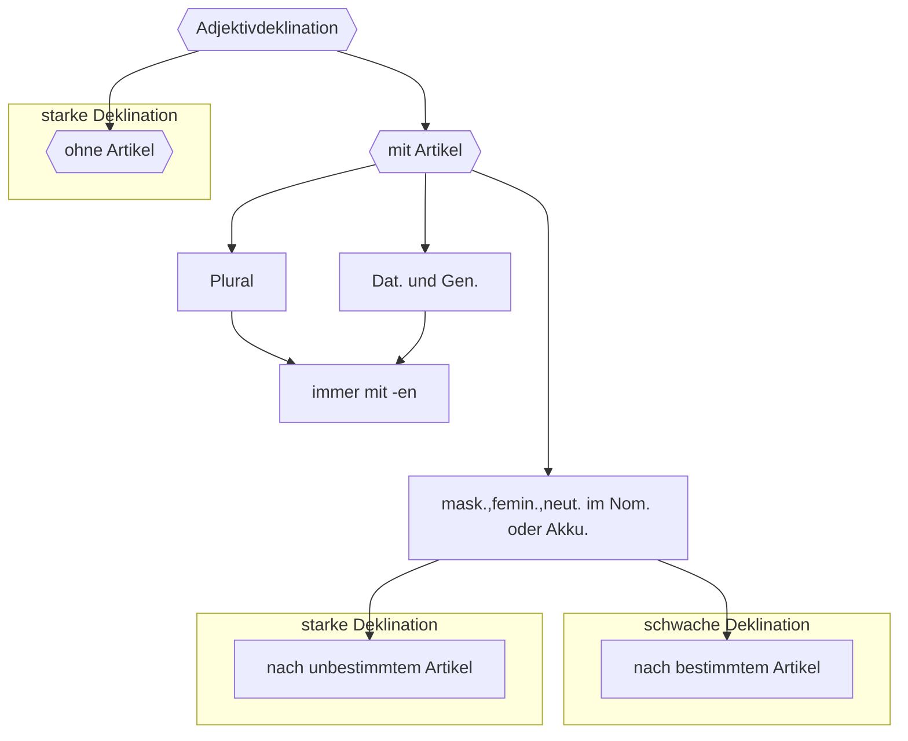

## 🔰Vokabeln

### Vorübung

| DEUTSCH                | ENGLISCH    | INFO      |
| ---------------------- | ----------- | --------- |
| der Schein,-e             | appearance  |           |
| der Struwwelpeter      |             |           |
| das Haar,-e            | hair        | #⚠️Plural |
| das Ohr,-en 👂          | ear         | #⚠️Plural |
| das Gesicht,-er 😐     | face        |           |
| das Auge,-n     👁️     | eye         |           |
| der Mund,Münder 👄     | mouth       |           |
| die  Lippe,-n 👄        | lip         |           |
| der Hals,Hälse         | neck        |           |
| dick                   | fat         |           |
| der Körper,-           | body        |           |
| die  Schulter,-n        | shoulder    |           |
| die  Brust,Brüste       | breast      |           |
| der Rücken,-           | back        |           |
| der Bauch,Bäuche       | belly       |           |
| der Arm,-e             | arm         | #⚠️Plural           |
| der Finger,-           | finger      |           |
| der Fingernagel,-nägel | finger nail |           |
| das Bein,-e            | leg         |   #⚠️Plural         |
| die  Zehe,-n            | toe         |           |
| dünn                   | thin        |           |
| schwach                | weak        |           |
| böse                   | naughty            |           |
![[015 L2 Vokabeln-Voruebung.mp3]]
### Text 1

| DEUTSCH               | ENGLISCH          | INFO   |
| --------------------- | ----------------- | ------ |
| die  Anzeige,-n        | advertisement     |        |
| drum=darum            | therefore         |        |
| prüfen                | examine           | +Akku. |
| sich binden           | retain oneself    |        |
| schlank               | slimm             |        |
| blond                 | blond             |        |
| sportlich             | sporty            |        |
| grau                  | grey              |        |
| klug                  | smart             |        |
| der/das Meter         | meter             |        |
| die  Frisur,-en 💇‍♀️  | hairstyle         |        |
| der Typ,-en           | type              | #⚠️Plural        |
| dunkel                | dark              |        |
| die  Figur,-en         | figure,body shape |        |
| oje                   | intj. ja          |        |
| die  Äußerlichkeit,-en | appearance        |        |
| krumm                 | adj.bent          |        |
| schmal                | adj.narrow,slim   |        |
| hoch(hoh-)            | adj.high          |        |
| die  Stirn,-en         | forehead          |        |
| das Ausehen           | appearance        |        |
| der Charakter,-e      | character         |        |
| sympathisch           | adj.likebale,pleasant                  |        |

![[016 L2 Vokabeln-T1.mp3]]

___
### Text 2

| DEUTSCH          | ENGLISCH               | INFO           |
| ---------------- | ---------------------- | -------------- |
| der Ingenieur,-e | engineer               |                |
| lustig           | adj. haapy 😝          |                |
| begleiten        | to accompany           |                |
| der Rentner,-    | pensioner              |                |
| reiselustig      | adj. fond of traveling |                |
| tierlieb         | adj. animal-loving     |                |
| kennen lernen    | get to know            | +Akku.         |
| unabhängig       | independent            | =selbstständig |
![[017 L2 Vokabeln-T2.mp3]]
____
### Text 3

| DEUTSCH | ENGLISCH | INFO |
| ---- | ---- | ---- |
| der Vorname,-ns,-n | given name |  |
| der Nachname,-ns,-n | family name |  |
| taub | adj. deaf |  |
| der Komponist,-en | composer |  |
| composinieren | compose | +Akku. |
| das Werk,-e | work | #⚠️Plural |
| nötig | necessary |  |
| genügen | to meet (a need),satisfy |  |
| der Vermieter,- | host |  |
| schwerhörig | adj. hard of hearing |  |
| die  Sinfonie,-n | symphony |  |
| das Lied,er | song |  |
| der Nobelpreis,-e | nobel prize |  |
| der Nobelpreisträger,- | nobel prize winner |  |
| die  Aufnahmeprüfung,-en | entrance exam |  |
| schaffen,schafft,schuff,hat geschaffen | to finish,accomplish |  |
| der Physiker,- 👨‍🔬 | physicist |  |
| der Takt,-e | time,clock,cycle |  |
| der Mitspieler,- | participant |  |
| das Rechnen | computation |  |
| die  Mathematik | mathematic |  |
| die  Gleichung,-en | equation |  |
| die  Physik ⚛️ | physic |  |
| der Direktor,-en | directer,principal |  |
| das Institut,-e | institute |  |
| die  Stelle,-n | place,position |  |
| verlieren | to lose sth. |  |
| jüdisch | adj. jewish |  |
| die  Forschung,-en | research |  |
| die  Atombombe,-n | atomic bomber |  |
| möglich | adk.&adv possible(-bly) |  |
| sterben,stirbt,starb,ist gestorben | to die  |  |
| der Forscher,- | researcher |  |
| der Frieden | peace |  |
| der Dichter,- | poet |  |
| eigen | adj.own, private |  |
| pleite | adj. bankrupted |  |
| reich | adj. rich |  |
| das Jurastudium |  |  |
| die  Kneipe,-n | pub,bar |  |
| ruinieren | ruin |  |
| verlasst,verlässt,verließ,hat verlassen | to leave |  |
| der Abschluss,-schlüsse | graduation |  |
| veröffentlichen | to publish | +Akku. |
| ironisch | adj. ironical |  |
| kritisch | adj. critical |  |
| politisch | adj. political |  |
| das Gedicht,-e | poem |  |
| die  Literatur | literature |  |
| ab | from | +Dat. |
| der Journalist,-en | journalist |  |
| der Schriftsteller,- | writer |  |
| das Märchen,- | fairy tale |  |
| ...järig | ...-year-old |  |

![[018 L2 Vokabeln-T3.mp3]]

## 📄Texte
### T1 : 

![[010 L2 T1 Drum pruefe, wer sich ewig bindet.mp3]]
### T2 : Wer passt (vielleicht) zu wem?

![[011 L2 T2 Werpasst (vielleicht) zu wem.mp3]]

### T3 : Wer war's
#### Der taube Komponist
Er hat von 1770 bis 1827 gelebt. Seine Heimatstadt war Bonn, aber er hat einen niederländischen Namen. Seit 1792 ist seine zweite Heimat Wien. Hier komponiert er seine großen Werke.

„Seine Wohnung ist ein Chaos. Überall liegen Papier und Kleidungsstücke, seine Sachen sind in Koffern, er hat kaum Möbel, nur ein paar Stühle, und die sind kaputt." So berichtet der Komponist Karl Czerny über einen Besuch bei ihm.

Zu dieser Zeit ist er schon in ganz Europa bekannt. Adresse nicht nötig, Name genügt, <mark style="background: #CACFD9A6;">wenn man an ihn schreiben will</mark>, sagt er. Das war ein praktischer Rat, denn etwa siebzig Mal ist er umgezogen. Oder er musste umziehen wegen Problemen mit seinen Vermietern.

1795 wird er schwerhörig, 1819 ist er taub. Die weltberühmte Neunte Sinfonie mit dem Lied „An die Freude" hat er selbst nie gehört.

#### Der Nobelpreisträger kann nicht zählen
„Viel zu dick! Viel zu dick!" sind die ersten Worte seiner Großmutter über das Kind. Aber es wird ein normaler, gesunder Junge. Nur in der Schule ist er nicht besonders gut. Die Aufnahmeprüfung der Technischen Hochschule Zürich schafft er erst beim zweiten Mal. 1902 wird er Physiker in der Schweiz.

Der kleine Job gibt ihm Zeit für das große Hobby Geigespielen. Er spielt oft und gern vor Freunden, kommt aber leicht aus dem Takt. „Sein Problem ist, er kann nicht zählen", meint ein Mitspieler. ,Du bist in der Schule nicht gut im Rechnen?", sagt er einmal zu einem Mädchen. „Glaube mir, ich habe noch viel mehr Probleme mit der Mathematik. "

Mit 26 Jahren findet er die wichtige Gleichung „$E = mc$" 1921 bekommt er den Nobelpreis für Physik. Da ist er schon Direktor des Kaiser-Wilhelm-Instituts in Berlin. Diese Stelle verliert er 1933 - seine Familie ist jüdisch-und er geht in die USA.

Durch seine Forschung wird die Atombombe möglich. Der Forscher selbst arbeitet bis zum Ende seines Lebens für den Frieden in der Welt. Er stirbt am 18. 4. 1955 in Princeton, USA, <mark style="background: #FFF3A3A6;">im Alter von 76 Jahren</mark>.

> [!tip] im Alter von 76 Jahren = at the age of ...

>$E = mc$ lies: E ist gleich m mal c-Quadrat.

#### Der Dichter im Grab ohne Ruhe
Eigentlich heißt er Harry, verwendet aber später die deutsche Übersetzung des Vornamens. Er ist der Sohn eines jüdischen Geschäftsmanns und soll auch Geschäftsmann werden. Ein Onkel gibt ihm Geld für eine eigene Firma. Nach ein paar Monaten ist Harry pleite. Nun bezahlt ihm dieser reiche Onkel ein Jurastudium, doch er liest lieber und trinkt Bier im „Rathskeller", einer Kneipe in Göttingen. „Die Bibliothek und der Rathskeller ruinieren mich", schreibt er einem Freund. Zweimal muss er die Universität verlassen. 1825 schafft er den Abschluss und wird Dr. jur. In diesem Jahr veröffentlicht er seine ersten Werke, ironische, kritische und manchmal politische Gedichte. Seine Literatur ist in Österreich und später auch in Deutschland verboten.

In Frankreich hat er mehr Glück. Dort lebt er ab 1831 als Journalist und Schriftsteller und lernt Karl Marx kennen. Nur zweimal besucht er noch Deutschland und schreibt das bekannte Werk „Deutschland. Ein Wintermär-chen"

Da ist er schon sehr krank. Acht Jahre lang kann er nur noch im Bett liegen, in seinem „Grab ohne Ruhe". <mark style="background: #FFB86CA6;">Er stirbt 58-jährig</mark> am 17. 2. 1856 in Paris.

![[013 L2 T3 Wer war's.mp3]]
____
## 📖Wörter
### W1 : Körperteil in Wort und Wendung

| Wendungen                                     | Bedeutung                                  |
| --------------------------------------------- | ------------------------------------------ |
| ein langes Gesicht machen                     | enttäuscht sein                            |
| ganz Ohr sein                                 | genau zuhören                              |
| etwas im Kopf haben                           | etwas wissen                               |
| von der Hand in den Mund leben                | nicht gespart haben/ganz wenig Geld haben  |
| unter vier Augen sprechen                     | nur mit einem Menschen über etwas sprechen |
| beide Hände voll zu tun haben                 | sehr viel Arbeit haben                     |
| den Mund voll nehemn                          | zu viel verprechen/angebe                  |
| ein Gesicht wie drei Tage Regnenwetter machen | sehr unzufrieden/unglücklich sein          |
| die Beine unter die Arme nehmen               | sehr schnell laufen                                           |
### W2 : Wortbildung : Präfix *-un*

## 🚦Grammatik
### Adjektivdeklination

also : 
1. wenn der Artikel *-en* (z.B. den,meinen,keinen) vor dem Adjektiv steht ,ist die Endung des Adjectives immer *-en*
2. wenn der Artikel *-e* (z.B. die,meine,keine) vor dem Adjektiv steht ,ist die Endung des Adjectives immer *-en*

#### Starke Deklination
|       | Maskulin | Neutral | Feminlin | Plural |
| ----- | -------- | ------- | -------- | ------ |
| Nom.  | -er      | -es     | -e       | -e     |
| Akku. | -en      | -es     | -e       | -e     |
| Dat.  | -em      | -em     | -er      | -en    |
| Gen.  | -en      | -en     | -er      | -er       | 

 #### Adjekivdeklination mit Artikel im Nominativ und Akkusativ

|                      | Maskulin             | Neutral       | Feminin               | Plural          |
| -------------------- | -------------------- | ------------- | --------------------- | --------------- |
| bestimmte Artikeln   | der stark**e** Mann 💪   | das groß**e** 🍺  | die rot**e** Blume 🌹 | die Hübschen Kinder 👦 |
| unbestimmte Artikeln | mein stark**er** Mann  💪 | mein groß**es** 🍺 | meine rot**e** Blume 🌹    | meine  Hübsch**en** Kinder 👦               |

## 🧭 Übung

##### Übung mit der Verben

1. genügen + D (+zu/für)
Ein Meter Stoff genügt mir für einen Rock.

2. begleiten + A + Dir.
Der Gott hat uns nach dem Weg zu Frieden begleitet.

3. verlieren,verliert,verlor,verloren
Verdammt! Ich habe meine Schlüssel verloren! 😩 

4. verlassen,verlässt,verloß,hat verlassen
Ich musste das Meeting verlassen, um ein wichtiges Telefonat anzunehmen.

5. ruinieren

##### Übersetzung
1. Schon als Student schrieb er politische Gedichte.Von 1826 bis 1831 veröffentlichte er zahlreiche Reisebeschreibungen, darunter die Harzreise.Mit diesen ironisch-kritischen Werken wurde er in Deutschland und Österreich berühmt.

2. Im Jahr 1831 verließ er seine Heimatstadt und ging nach Paris, wo er als Journalist und als Schriftsteller arbeitete.in der Zeit lernte er Karl Marx kennen.

##### Schreiben
