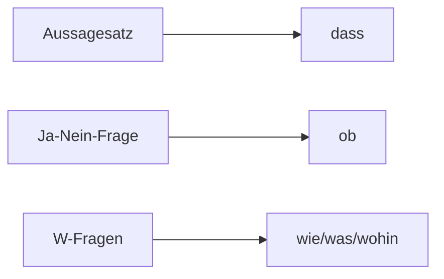

## 🔰Vokabeln
### Vorübung

| DEUTSCH                                           | ENGLISCH        | INFO |
| ------------------------------------------------- | --------------- | ---- |
| der Raub,-e                                          | robbery         |      |
| die   Lüge,-n                                       | lie             |      |
| der Betrug                                        | betray          |      |
| der Krimi,-s                                      | criminal series |      |
| der Einbrecher,-                                  | burglar         |      |
| der Einbruch,-brüche                              | burglary        |      |
| ein/brechen,bricht ein,brach ein,hat eingebrochen | to break in     |  +Dir.      |
| stehlen,stieht,stahl,hat gestohlen                | steal           |  +Akku.    |
| der Dieb,-e                                       | thef            |      |
| die   Polizei                                       | police          |      |
| der Polizist,-en                                  | policeman       |      |
| weg/laufen                                        | run away 🏃     |      |
| der Bericht,-e                                    | repo                |      |
![[026 L3 Vokabeln-Voruebung.mp3]]
____
### Text 1

| DEUTSCH                    | ENGLISCH       | INFO |
| -------------------------- | -------------- | ---- |
| die   Polizeidienststelle,-n | police station |      |
| der Inspektor,-en          | insprecter     |      |
| die   Schublade,-n           | straw          |      |
| der Tatort,-e              |                |      |
![[027 L3 Vokabeln-T1.mp3]]
___
### Text 2
| DEUTSCH                                               | ENGLISCH             | INFO                  |
| ----------------------------------------------------- | -------------------- | --------------------- |
| der Zeuge,-n,-n                                          | witness              |                       |
| springen,springt,sprang,hat gesprungen                | jump,hop,spring      | +Dir.                 |
| braun                                                 | adj. brown           |                       |
| der Schrei,e                                          | cry                  |                       |
| die   Straßenseite,-n                                   |                      |                       |
| vorbei/laufen                                         | run past             | an+Dat. #✳️Verwendung |
| der Täter,-                                           | prepatrator,offender |                       |
| beschreiben,beschreibt, beschrieb,hat beschrieben | describe             |                       |
| breit                                                 | adj.broad            |                       |
| stark                                                 | adj.strong           |                       |
| der Bart,Bärte 🧔‍♂️                                  | bear                 |                       |
| also                                                  | adv.                 |                       |
| ob                                                    | conj. wether         |                       |
| dass                                                  | conj.                |                       |
| auf/haben                                             | to wear (hat 🎩)     | +Akku.                |
| hell                                                  | adj.bright           |                       |
| an/haben                                              | to wear (clothes 👗) | +Akku.                |
| blau                                                  | adj. blue            |                       |
| grün                                                  | adj.green            |                       |
| geradeous                                             | adv. straightforward |                       |
| das Tempo,-s                                          | speed                |                       |
| die   Ampel,-n                                          | traffic light🚥      |                       |
| die   U-Bahn,-en                                        | subway               |                       |
| der Nachbar,-n                                        | neighbor             | #⚠️Plural                       |

![[028 L3 Vokabeln-T2.mp3]]

> [!info]- Unterschieden zwischen an/haben und auf/haben
> "Anhaben" bedeutet, dass man Kleidung oder Accessoires trägt, die   direkt auf dem Körper getragen werden. Zum Beispiel: "Ich habe eine Jacke an." oder "Sie hat eine Kette an."
> "Aufhaben" bedeutet, dass man etwas <mark style="background: #ADCCFFA6;">auf dem Kopf</mark>, auf den Schultern oder auf einer anderen Körperpartie trägt, die   nicht direkt anliegt. Zum Beispiel: "Ich habe einen Hut auf." oder "Er hat eine Tasche auf der Schulter."

> [!warning] "Zeuge" ist n-Deklination!

___
### Text 3

| DEUTSCH                                                     | ENGLISCH             | INFO   |
| ----------------------------------------------------------- | -------------------- | ------ |
| der Gauner,-                                                | crook                |        |
| der Ganove,-n                                               | theft,liar           |        |
| durch/blicken                                               | look through         |        |
| der Schwindel                                               | dizziness            |        |
| die   Luft                                                    | air                  |        |
| rein                                                        | adj.pure, clean      |        |
| lügen,lügt,log,gelogen 🤥                                   | to tell a lie        |         |
| der Räuber,-                                                | robber               |        |
| zurück/geben,gibt zurück, ,gab zurück,hat zurückgegeben | to return,give back  |        |
| die Versicherung,-en                                        | insurance            |        |
| die   Hälfte,-n                                               | a half               |        |
| der Wert,e                                                  | value                |        |
| ehrlich                                                     | honest,frank         |        |
| der Zufall,-fälle                                           | accident             |        |
| das Pech                                                    | bad luck             |        |
| Pech haben                                                  | to have bad luck     |        |
| das Nachbarhaus,-häuser                                     | neighbor house       |        |
| auf/brechen,bricht auf, brach auf,hat aufgebrochen      | to break (the door)  | +Akku. |
| der Spaziergänger,-                                         | walker,stroler       |        |
| verdächtig                                                  | adj.suspect          |        |
| schräg                                                      | adj.oblique,slopping |        |
| der Vogel,Vögel                                             | bird                 |        |
| ein Schwäger Vogel                                          |                      |        |
| der Besitzer,-                                              | owner                |        |
| der Hausbesitzer ,-                                         | house owner                     |        |
![[029 L3 Vokabeln-T3.mp3]]
___
### Wörter

| DEUTSCH                        | ENGLISCH | INFO |
| ------------------------------ | -------- | ---- |
| geboren                        |          |      |
| gelb                           | yellow   |      |
| die   Zitrone,-n                 | lemon    |      |
| die   Asche                      | ash      |      |
| das Feuer,- 🔥                 | fire     |      |
| tragen,trägt,trug,hat getragen | wear         |      |
### Grammatik

| DEUTSCH                              | ENGLISCH          | INFO  |
| ------------------------------------ | ----------------- | ----- |
| der Fahrer,-                         | driver            |       |
| betrügen,betrügt,betrog,hat betrogen | to cheat ,deceive | +Akku |
| das Licht,-er                        | light             |       |
| die   Straßenlampe,-n                  | street light      |       |
| der Versuch,-e                       | attempt,try                  |       |

![[030 L3 Vokabeln-Woerter.mp3]]

> [!tip] Unterschieden
> lügen,lügt,log,hat gelogen : to tell a lie
> betrügen,betrügt,betrog,betrogrn : to cheat 

___
## 📄Texte

### T1 : Ein Einbruch
- Polizist: Polizeidienststelle 212, Inspektor Wolf.
- Frau Z. : Kommen Sie schnell! Ein Einbruch!
- Polizist: Nun mal ganz langsam. Wer sind Sie und wohin sollen wir kommen?
- Frau Z. : Mein ganzer Schmuck <mark style="background: #ABF7F7A6;">ist weg</mark>!
- Polizist: Sagen Sie mir doch erst einmal, wer Sie sind und wo Sie wohnen.Und dann erzählen Sie bitte ganz ruhig, was los war.
- Frau Z. : Ziegler, Beate Ziegler, Grunewaldstraße 31. Er ist durchs Fenster gekommen. Ein junger Mann war es mit kurzen Haaren und mit einer runden Brille. Der Schmuck war in der Schublade. 8000 Euro ist er wert, mindestens. Und jetzt ...
- Polizist: Einen Moment, Frau Ziegler, hören Sie bitte mal zu. In der Wohnung muss jetzt alles so bleiben, wie es ist. Wir kommen sofort.
![[021 L3 T1 Ein Einbruch.mp3]]
___
### T2 : Zeugen

> [!tip] Verben
> biegen , biegt , bog ,hat gebogen
> schreien , schreit , schrie , hat geschrien

- 👮Inspektor: Also, Sie haben gesehen, wie ein Mann aus dem Fenster gesprungen ist.
 - Zeuge 1: Ja, aus dem zweiten Fenster von rechts, rechts neben der braunen Haustür. Ich habe unter der Straßenlampe gestanden und den Schrei der alten Dame gehört. Und dann habe ich ihn gesehen.
- Zeuge 2: Ich auch. Ich war auf der anderen Straßenseite rechts neben den Bäumen und er ist <mark style="background: #FF5582A6;">an mir vorbeigelaufen</mark>.
- 👮Inspektor: Können Sie den Täter beschreiben?
- Zeuge 1: Ja, es war ein junger Mann, ziemlich groß.
- 👮Inspektor: Und die Figur dieses jungen Mannes?
- Zeuge 1: Er war schlank.
- Zeuge 2: Ja, es war ein schlanker Mann, aber mit breiten Schultern, sicher stark, Mitte 20, mit langem, schwarzem Haar und einem kleinen Bart.
- Zeuge 1: Was für Haare hatte er? Schwarze? Nein, die Haare waren nicht schwarz.
- 👮Inspektor: Also, Sie wissen nicht, ob er schwarzes oder blondes Haar hatte?
- Zeuge 1: Doch, ich weiß, dass er langhaarig war und dass seine Haare nicht schwarz waren.
- Zeuge 2: Na, in der Nacht sind alle Katzen grau. Vielleicht waren es dunkelblonde Haare. Seine Augen waren braun.
- Zeuge 1: Woher wollen Sie denn wissen, wie seine Augen waren? Man konnte sie doch gar nicht sehen wegen der dunklen Brille.
- Zeuge 2: Was erzählen Sie da? Er hatte doch gar keine Brille.
- 👮Inspektor: Einen Augenblick bitte. Es ist für uns nicht so wichtig, ob der Täter eine Brille aufhatte oder ob er keine Brille aufhatte. Aber Sie sagen, dass der Mann groß war. Wie groß denn etwa?
- Zeuge 2: Bestimmt über 1,85 m.
- Zeuge 1: Ich bin sicher, dass er mindestens 1,90 m groß war.
- 👮Inspektor: Können Sie die Kleidung des Täters beschreiben?
- Zeuge 1: Ein helles Hemd und ...
- Zeuge 2: Nein, er hatte eine helle Jacke über einer blauen Hose an.
- Zeuge 1: Einer blauen Hose? Nein, die Hose war dunkelgrün. Das weiß ich ganz genau.
- 👮Inspektor: Können Sie mir noch sagen, wohin er gelaufen ist?
- Zeuge 2: Erst geradeaus mit großem Tempo bis zu der Kreuzung mit den Ampeln. Dort ist er nach links abgebogen. Wahrscheinlich wollte er zur U-Bahn.Ich glaube, dass er ... - Oh! Das ist er ja!Das ist der Dieb! Der ist es gewesen!
- Erwin Z. : Guten Tag, Erwin Ziegler. Ich habe gehört, dass man bei meiner Tante eingebrochen hat. Kann ich helfen?
![[022 L3 T2 Zeugen.mp3]]

###### Ü6
Frau Kurz: Haben Sie schon von dieser schrecklichen Sache gehört?

Frau Lang: Bei Frau Ziegler? Ja, Frau Kurz. Die arme, alte Dame hatte wirklich Pech!

Frau Kurz: Es war nur Glück, dass sie aufgewacht ist.

Frau Lang: Glück im Unglück. Frau Breit hat mir gesagt, dass Frau Ziegler den Einbrecher erkannt hat.

Frau Kurz: <mark style="background: #FFF3A3A6;">Nein, Frau Lang, ich glaube nicht, dass sie ihn erkannt hat. Sie ist aufgewacht, hat im Flur Schritte gehört und hat die Schlafzimmertür aufgemacht.</mark> Und da hat sie gerade noch geschen, wie der Mann ins Arbeitszimmer gelaufen ist und aus dem Fenster gesprungen ist.

Frau Lang: Ist sie denn ganz allein im Haus gewesen?

Frau Kurz: Ja. Sie hat laut geschrien und da war er schon weg. Aber ihr Schmuck auch.

Frau Lang: Wissen Sie, ob er sehr wertvoll wat, Frau Lang?

Frau Kurz: Ich weiß nicht, aber besonders viel wert war er bestimmt nicht. Ein paar hundert Euro vielleicht. Frau Ziegler ist ja nicht besonders reich.

Frau Lang: Und wie hat der Dieb ausgesehen?

Frau Kurz: Groß und stark war er, einen langen Bart hat er gehabt und lange, schwarze Haare. Und eine Brille hat er aufgehabt.

Frau Lang: Ja, langhaarige Typen mit Brille und Bart sind immer verdächtig. Und schwarze Haare?Bestimmt ein Ausländer.

Frau Kurz: Aber Frau Lang, das sind doch Vorurteile. Ich habe gehört, dass es der Neffe von Frau Ziegler war.

![[023 L3 ü6 Nachbarinnen.mp3]]
___
### T3 : Lauter Gauner und Ganoven.Wer blickt denn da noch durch?
![[024 L3 T3.1 Alles Schwindel.mp3]]
## 📖Wörter
### W1 : Die Ordinalzahlen

|     |                |
| --- | -------------- |
| 1.  | **erste**      |
| 2.  | zweite         |
| 3.  | **dritte**     |
| 4.  | vierte         |
| 5.  | fünfte         |
| 6.  | sechste        |
| 7.  | **seib(en)te** |
| 8.  | achte          |
| 9.  | neunte         |
| 10. | zehente        |
| 20. | **zwanzigste**               |

1. <mark style="background: #FF5582A6;">Die Ordinalzahlen sind Adjektive </mark>: 
der este Tag ; die zweite Woche ; das Dritte Haus
2. Einige Ordinalzahlen sind unregelmäßig.Von der *zweite* bis der *neunzehente* enden die Ordinalzahlen auf *-te(n)* , ab der *zwanzigste* auf *-ste(n)*
____
### W2 : das Datum
###### 1. Jahreszahlen

| Zahlen | Buchstaben                      |
| ------ | ------------------------------- |
| 1991   | neunzehen/hundert/einundneunzig |
| 850    | acht/hundert/fünfzig            |
| 2002   | zwei/tausend/zwei               |
| 2012   | zwei/tausend/zwölf              |
| 2023   | zwei/tausend/dreiundzwanzig     |

###### 2. Der Tag

|               |                                                    |
| ------------- | -------------------------------------------------- |
| Mittwoch,10.5 | Heute ist Mittwoch,der zehnte Mai/Fünfte           |
| 17.12.1770    | Beethoven ist am 17 Zwölften/Dezember 1770 geborn. |
| 26.3.1827     | Beethoven ist am 26. Dritten/März gestorben.       |

###### 3. der Wievielter?
1. Der Wievielte ist heute/morgen?
- Der sechste April
- Der erste März
2. Der wievielte war gester/vorgestern ?
+ Der achte Juli.
+ Der Zwanzigste Mai.

###### 4. Welchen Tag,Welches Datum,Den Wievielten
1. Welchen Tag haben wir heute/morgen?
- Den vierten Mai.
- Den einsundzwanzigsten Dezember.

2. Welchest Datum haben wir morgen?
- Den neuten Januar
- Den dreißigsten Febuar.

3. Den Wievielten hatten wir gestern/vorgestern?
- Den fünften Oktober.

5. Welcher Tag

1. Welcher Tag ist heute/morgen ?
- Dienstag,21.Juli.

2. Welcher Tag war gestern?
- Freitag,22,September.
___
### G3 : Die Farben
![[Farben.jpeg]]

____
## 🚦Grammatik
### G1 : Nebensätze : *dass-*,*ob-* und Indirekte *W*-frage
Frau Ziegler ruft einen Polizisten an und will ihm von dem Einbruch bei ihr zu Hause berichten. Der Polizist fragt sie, **wie** sie heißt, **wo** sie wohnt und **was** los war. Er möchte, **dass** sie alles in Ruhe erzählt. Dann fragt er sie noch, **ob** sie den Einbrecher gesehen hat und wie er aussieht. Er sagt, dass er gleich kommt und dass alles in der Wohnung so bleiben muss, wie es ist.

###### 1. Satzgefüge : Hauptsatz + Nebensatz

| Direkter Hauputsatz                  | Satzegefüge:Hauptsatz   | Nebensatz                          |
| ------------------------------------ | ----------------------- | ---------------------------------- |
| „ Was war bei Ihnen los“             | Der Polizist fragt,     | was bei Ihr los was.               |
| „ Mein ganzer Schmuck ist weg“       | Frau Ziegler sagt,      | dass ihr ganzer Schmuck weg ist.   |
| „ Haben Sie den Einbrecher gesehen?“ | Der Polizist fragt sie, | ob sie den Einbrecher gesehen hat. |

###### 2. Subjunktoren *dass*,*ob* und Fragewöter

###### 3. Nebensätze mit Verb-Endstellung

|     | V1   |                | V2       |
| --- | ---- | -------------- | -------- |
| Sie | hat  | den Einbrecher | gesehen. |
| Sie | ruft | die Polizei    | an.      |

| Hauptsatz | Subjunktor |                        | V2 + V1      |
| --------- | ---------- | ---------------------- | ------------ |
| Sie sagt, | dass       | sie den Einbrecher     | gesehen hat. |
| Sie sagt, | dass       | sie gleich die Polizei | an ruft.             |

- Das Satzgefüge hat das Satzzeichen des Hauptsatzes
- Im Nebensatz steht das konjungiert Verb am Ende
- Trennbare Verben werden im Nebensatz nicht getrennt

###### 4. Funktion des Nebensatzes : satzförmige Ergänzungen

## 🧭 Übung
### Ü1 : *tragen*,*aufhaben* und *anhaben*

|                       | tragen | aufhaben | anhaben |
| --------------------- | ------ | -------- | ------- |
| einen Hut 🧢          | ✅     | ✅       |         |
| einen neuen Mantel 🧥 | ✅     |          | ✅      |
| eine Brille Brille 👓 | ✅     |          |         |
| einen kurzen Bart 🧔  | ✅     |          |         |
| eine Perlenkette      | ✅     |          |         |
| eine Jacke 🧥         | ✅     |          | ✅      |
| eine Mütze            | ✅     | ✅       |         |
| einen Pullover        | ✅     |          | ✅      |
| weiße Tennisschuhe    | ✅     |          | ✅      |
| kurze Socken          | ✅     |          | ✅      |
| das Kind auf dem Arm  | ✅     |          |         |
| einen Koffer ins Haus | ✅     |          |         |

### Ü2 : Ubersetzung

1. Der Polizist fragte den Zeugen , ob er den Schein des Täters genau beschreiben konnte.
2. Der Zeuge sagte, dass der Täter 1.80 meter hoch , 25-järig,mit langen Haaren und einer Brille war.
3. Frau Ziegler und ihr Neffe haben einen Falschen Einbruch gespielt.Ihr Zweck war ein Versicherungsbetrug.Aber aller Schmuck der Frau war im Kühlschrank beim ihrem Neffe.