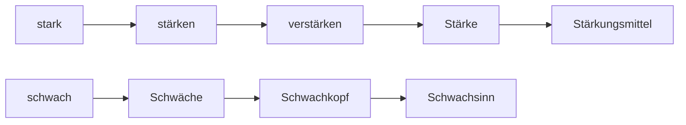

## 🔰Vokabeln
###  Vorübung

| DEUTSCH              | ENGLISCH      | INFO |
| -------------------- | ------------- | ---- |
| die  Muttersprache,-n | mother tounge |      |
| die  Lesetechnik,-en  | reading               |      |
___
### Text 1

| DEUTSCH                                                        | ENGLISCH                       | INFO                       |
| -------------------------------------------------------------- | ------------------------------ | -------------------------- |
| die  Lust                                                       | interest                       |                            |
| die  Leselust                                                   | reading interest               |                            |
| der Frust                                                      | frastration                    |                            |
| der Lesefrust                                                  |                                |                            |
| statt + Gen.                                                   | instead of                     |                            |
| auf/schlagen,schlägt auf, schlug auf,hat aufgeschlagen     | to open                        |                            |
| irgendwo                                                       | somewhere                      |                            |
| informiert                                                     | adj. informed                  |                            |
| schwierig                                                      | adj. difficult                 | =schwer                    |
| fremd                                                          | adj.foreign                    |                            |
| furchtbar                                                      | adj. terible                   |                            |
| kompliziert                                                    | adj.complicated                |                            |
| nach/schlagen,schlägt nach, schlug nach,hat nachgeschlagen | to look through                |                            |
| blättern                                                       | to scoll,browse                |                            |
| herum/suchen                                                   | to look everywhere             |                            |
| um/stoßen,stößt um, stieß um,hat umgestoßen                | to knock off                   | +Akku.                     |
| frustriert                                                     | adj. frastrated                |                            |
| der Unterschied,-e                                             | difference                     |                            |
| der Muttersprachler,-                                          | native speaker                 |                            |
| erfahren,erfährt,erfuhr,hat erfahren                           | to experience,learn sth.       | +Akku.                     |
| erweitern                                                      | to expand,extend               | +Akku.                     |
| grammatisch                                                    | adj.grammatical                |                            |
| die  Struktur,-en                                               | structure                      |                            |
| zuletzt                                                        | adv.last,finaly                |                            |
| das Gefühl,-e                                                  | feeling                        |                            |
| das Sprachgefühl,-e                                            | feeling for language           |                            |
| verbessern                                                     | to improve                     | +Akku.                     |
| deswegen                                                       | adv.therefore                  |                            |
| weit                                                           | adj.&adv. far                  |                            |
| überfliegen,überfliegt ,überflog,hat überflogen                    | to skim,scan                   |                            |
| der Artikel,-                                                  | article,passage                |                            |
| allgemein                                                      | adj.common                     |                            |
| global                                                         | adj.&adv. global               |                            |
| der Fahrplan,-pläne                                            | timetable(of train)            |                            |
| der Sportbericht,-e                                            | sport report                   |                            |
| interessieren                                                  | to interest                    | +Akku.                     |
| überlesen,überliest,überlas,hat überlesen                          | to skim,scanf\                 | +Akku.                     |
| Wort für Wort                                                  | word by word                   |                            |
| die  Textsorte,-n                                               | text type                      |                            |
| der Vertrag,Verträge                                           | contrast                       | vertrage v.--> to tolerate |
| die  Gebrauchsanleitung,-en                                     | instruction,instruction manual |                            |
| der Liebersberief,-e                                           | love letter                    |                            |
| das Detail,-s                                                  | detail                         |                            |
| detaillier                                                     | adj. detailed                  |                            |
| die  Technik,-en                                                | technique                      |                            |
| merken                                                         | to notice                      | +Akku.                     |
| best...                                                        | best                           |                            |
| die  Frustration,-en                                            | frastration                               |                            |
![[045 L5 Vokabeln-T1.mp3]]
___
### Text 2

| DEUTSCH                                                 | ENGLISCH                    | INFO         |
| ------------------------------------------------------- | --------------------------- | ------------ |
| der Studienweg,-e                                       | way of studying             |              |
| die  Leseratte,-n                                        | bookworm                    |              |
| bewusst                                                 | conscious                   |              |
| der Leser,-                                             | reader                      |              |
| der Denkprozess,-e                                      | thinking process            |              |
| die  Kurzgeschichte,-n                                   | schort story                |              |
| weiter/lesen                                            |                             |              |
| der Motorsport                                          |                             |              |
| die  Kultur,-en                                          | culture                     |              |
| durch/blättern                                          | to browse,look through      |              |
| der Gedanke,-n                                          | idea,thought,concept        | #⚠️Plural    |
| sich Gedanke machen über +Akku.                         | think on sth.               |              |
| sich entscheiden für + Akku.                            | decide on                   |              |
| entscheiden,entscheidet,entschied,hat entschieden       | to decide                   |              |
| entwickeln                                              | to develop                  | +Akku.       |
| die  Lesetrategie,-n                                     | reading strategy            |              |
| wählen                                                  | to choose                   | +Akku.       |
| der Sportteil,-e                                        |                             |              |
| die  Wirtschaft                                          | economy                     |              |
| wirtschaftlich                                          | economic                    |              |
| die  Entwicklung,-en                                     | development                 |              |
| sich informieren über                                   | to know                     |              |
| voraus                                                  | adv.ahead                   |              |
| im Voraus                                               | in advance                  |              |
| die  Überschrift,-en                                     | title                       |              |
| die  Startseite,-n                                       | start page                  |              |
| vor/kommen                                              | to appear                   |              |
| an/lesen                                                | 读了开头几页                | +Akku.       |
| der Abschnitt,-e                                        | paragraph                   |              |
| nach/denken,denkt nach, dachte nach,hat nachgedacht | contemplate                 | über + Akku. |
| unbekannt                                               | unknown,unfamiliar          |              |
| die  Vokabel,-n                                          | word                        |              |
| das Vokabelnhelft,-e                                     | word book                   |              |
| sich gewöhnen an + Akku.                                | be used to,be accostumed to |              |
| eher                                                    | rather                      |              |
| der Bücherwurm,-würmer                                  | bookworm                    |              |
![[046 L5 Vo-T2(L5).mp3]]

___
### Grammatik

| DEUTSCH                                 | ENGLISCH       | INFO   |
| --------------------------------------- | -------------- | ------ |
| die  Doktorarbeit,-en                    | doctoral theis |        |
| bestehen,bestieht,bestand,hat bestanden | to pass        | +Akku. |
| ein Examen bestehen                                        |                |        |

___

## 📄Texte
### T1 : Leselust statt Lesefrust
Ein Tag kann schön und interessant beginnen: Man steht auf, macht sich einen Kaffee oder einen Tee und fragt sich „Was gibt es Neues?" Man schlägt die Zeitung auf oder man surft im Internet, liest hier etwas, liest da etwas und irgendwo findet man etwas interessantes.Gut informiert beginnt man den neuen Tag.

Das Leben kann auch ganz schön schwierig sein. Man sitzt über einem Text in einer fremden Sprache. Aber schon das erste Wort kennt man nicht, da fünfte auch nicht, der zweite Satz ist furchtbar kompliziert. Man schlägt in Wörterbuch nach, blättert im Lehrbuch, sucht in der Grammatik herum. Beim zwanzigsten Wort stößt man seine Teetasse um und zum Schluss stellt man frustiert fest, dass der Text gar nicht interessant ist.

Leider ist es wirklich ein großer Unterschied, ob man in seiner Muttersprache liest oder in einer Fremdsprache.

Als Muttersprachler möchte man beim Lesen meistens etwas Neues erfahren.Beim Lesen in einer Fremdsprache will man dazu noch etwas lernen, seinen Wortschatz erweitern, das Erkennen von grammatischen Strukturen trainieren und nicht zuletzt sein Sprachgefühl verbessern. Deswegen ist Lesen wichtig.Aber lesen Sie richtig!

Mit der Frage „Was ist neu?" kommt man in der Fremdsprache nicht weit denn zu viel ist neu. Das Neue beginnt schon mit den Wörtern. Man muss fragen: „Was weiß ich schon?" Da stellt man fest, dass die Texte gar nicht so fremd sind, dass man vieles schon versteht. Oft kann man die gleichen Lese-techniken anwenden wie in der Muttersprache.

Welche Lesetechniken sind das?

Die meisten Texte überfliegt man nur, z. B. Zeitungsartikel. Man will ganz allgemein wissen, worum es in dem Text geht. Diese Lesetechnik nennt man **globales Lesen.**

Oft sucht man in einem Text eine ganz bestimmte Information: im Fahrplan die Abfahrt der Züge nach Chongqing, in einem Sportbericht das Ergebnis des Fußballspiels zwischen China und Deutschland. Alles anderes interessiert einen nicht, man überliest es. Diese Lesetechnik heißt **suchendes Lesen**.

Aber wenn das Ergebnis des Fußballspiels z. B. 6 : 0 für China ist, dann möchten Sie wahrscheinlich genau wissen, was da los war, und Sie lesen den Bericht Wort für Wort. Ganz genau muss man die Textsorten Vertrag und Gebrauchsanleitung lesen, aber auch bei einem Liebesbrief kommt es 35 manchmal auf jedes Detail an. Bei dieser Lesetechnik spricht man von **detailliertem Lesen**.

Wenn Sie mit klugen Fragen und der richtigen Technik einen deutschen Text lesen, merken Sie, dass Sie schon viel verstehen. Sie haben Erfolgserlebnisse, und Erfolg ist das beste Mittel gegen Frustration. Aus Lesefrust wird mit der Zeit Leselust.

![[042 L5 T1 Leselust statt Lesefrust.mp3]]
___
#### Ü3 Wie Heißt das Wort
##### blättern
Wenn man in einem Buch berumsuchen und dabei viele Seiten aufschlägt, dann **blättert** man im Buch.
Dieses Verb kommt von dem Nomen **Blatt**. Dieses Nomen hat bei Büchern oder Zeitungen die Bedeutung von Seite.
Oft hat das Verb die Vorsilbe *um-*. Das macht **umblättern**

##### überfleigen
Wenn man mit großem Tempo einen Text liest, den Inhalt fast nur wie ein Vogel aus der Luft anschaut,dann **überfliegt** man ihn.

##### überlesen
Bestimme Informatione werden beim Lesen gar nicht bewusst, man liest sie eigentlich nicht, sondern man überliest sie.

##### Frust
- Der Psychologische Fachbegriff ist : **Frustration**
- In der Umgangssprache und besonders in der Jungendsprache sagt man einfach **Frust**.Von dem Verb dazu finden Sie im Text das Partizip Perfekt frustiert.Das Verb heißt **frustieren**.
___
### T2 : Der Studienweg einer Leseratte

Muttersprachlern ist nicht bewusst, dass sie schon viel gedacht haben, wenn sie mit dem Lesen beginnen. Fremdsprachenleser sollen sich diesen Denkprozess bewusst machen.

Was denkt man vor dem Lesen? Hier einige Beispiele:

- Das ist ein Roman von Goethe. Der ist wahrscheinlich zu schwierig und zu lang. Den lese ich vielleicht in zwei Jahren.
- Ah, eine Kurzgeschichte von Heinrich Böll. Literatur interessiert mich, da überfliege ich mal zwei Seiten. Vielleicht verstehe ich schon etwas. Ob ich dann weiterlese, weiß ich noch nicht.
- „Wie sehen die Deutschen China?" Das interessiert mich. Den Artikel lese ich ganz genau.
- Da steht ein Bericht über das letzte Rennen der Formel 1. Wie langweilig! Motorsport interessiert mich nicht. <mark style="background: #FF5582A6;">Weg damit</mark>!
- Ein Gedicht? Ganz bestimmt schwierig. Aber ich will schon lange wissen, wie man Gedichte auf Deutsch schreibt. Ich lese es mal, ganz gleich, ob ich es verstehe oder nicht.
- Bis wann läuft eigentlich noch die Ausstellung ,Kunst und Kultur in Afrika"? Die will ich noch sehen. Ach, hier steht es ja.
- Interessant, eine deutsche Computerzeitschrift. Die blättere ich mal durch und schreibe mir die deutschen Fachbegriffe auf.

Man macht sich also schon vor dem Lesen Gedanken darüber, warum man etwas liest und wie man es liest. Man fragt sich: Was weiß ich schon? Was will ich wissen? Man entscheidet sich auch schon für eine bestimmte Lese-technik.

Bewusste Fremdsprachenleser entwickeln ihre eigenen Lesestrategien. Hier einige allgemeine Tipps:

1. Wählen Sie leichte und interessante Texte. Wenn Sie in einer chinesischen Zeitung immer zuerst den Sportteil lesen, blättern Sie in einer deutschen Zeitung auch im Sportteil. Wenn Sie sich für Wirtschaft interessieren, lesen Sie Artikel über die wirtschaftliche Entwicklung. Sie haben sich gerade einen Computer gekauft? Dann informieren Sie sich doch über Computerangebote auf Deutsch! Wenn Sie schon viel über ein Thema wissen, verstehen Sie den Text in der Fremdsprache besser.
2. Üben Sie „Voraus-Denken". Lesen Sie Überschriften in Zeitungen, Zeitschriften und auf Startseiten im Internet und überlegen Sie: Was ist da wohl der Inhalt? Welche Wörter kommen wahrscheinlich vor? Welche Lesetech-nik passt zu dem Artikel oder zu dem Aufsatz?
3. Lesen Sie Texte an. Das heißt, überfliegen Sie einen Abschnitt oder eine Seite und entscheiden Sie dann, ob Sie weiterlesen wollen. Legen Sie zu schwierige oder uninteressante Texte zur Seite.
4. Denken Sie bei unbekannten Wörtern über ihre Bedeutung im Kontext nach. Schlagen Sie erst dann im Wörterbuch nach. Schreiben Sie nur wichtige Wörter in Ihre Lernkartei oder Ihr Vokabelheft.
5. Lesen Sie lieber schnell und viel - als zu wenig und zu detailliert. So gewöhnen Sie sich eher an grammatische Strukturen und verbessern Ihr Sprachgefühl.Eine gute Lesestrategie kann auch den Fremdsprachenleser zur Leseratte und zum Bücherwurm machen.

![[043 L5 T2 Der Studienweg einer Leseratte.mp3]]
___
## 📖Wörter
### W1 : Trainieren Sie Ihr Wöterbuch im Kopf
#### 1. Mehrere Wörter - eine Bedeutung
Wintersemester,Sommmersemester,Studienfach,Hauptfach,Nebenfach,Unterhose,Unterwäsche,Nachthemd,Schafenzug,Morgenmantel,Lautsprecher,Kamera-Handy,Musik-CD,Programmezietschrift,Zeigefinger,Ringfinger,Krankenversicherung,Schlafmittel,Erfolgsrezept

#### 2. Verwandte erkennen

___
## 🚦Grammatik
### G1 : Pronominaladverbien
#### 1. Präpositionen im Gebrauch

| auf + Akku. | mit + Dat.         | über + Akku.     |
| ----------- | ------------------ | ---------------- |
| aufpassen   | anfangen           | sprechen         |
| antworten   | beginnen           | berichten        |
| sich freuen | telefonieren       | nachdenken       |
| hoffen      | vergleichen        | schreiben        |
| warten      | verbinden          | diskutieren      |
|             | sich treffen       | sich informieren |
|             | einverstanden sein | sich freuen      |
|             | zufrieden sein     |                  |

| an + Akku.    | von + Dat. | zu + Dat.   |
| ------------- | ---------- | ----------- |
| denken        | träumen    | einladen    |
| glauben       | erzählen   | gratulieren |
| schreiben     | sprechen   |             |
| sich gewöhnen | berichten  |             |

| für + Akku.        | bei + Dat. | nach + Dat. |
| ------------------ | ---------- | ----------- |
| sich interessieren | helfen     | fragen      |
| sich entschudigen  |            | suchen      |
| sich entscheiden   |            |             |
| sparen             |            |             |
____
#### 2. Formen
###### ohne *r*

| Präpositionen | Fragewörter *wo* +Präp. | Pronomen *da* +Präp. |
| ------------- | ----------------------- | -------------------- |
| bei           | wobei                   | dabei                |
| für           | wofür                   | dafür                |
| gegen         | wogegen                 | dagegen              |
| hinter        | wohinter                | dahinter             |
| mit           | womit                   | damit                |
| noch          | wonach                  | danach               |
| neben         | ----                    | daneben              |
| von           | wovon                   | davon                |
| zu            | wozu                    | dzu                  |
| zwischen      | ---                     | dazwischen           |

###### mit *r*

| Präpositionen | Fragewörter *wo*+*r*+Präp. | Pronomen *da*+*r*+Präp. |
| ------------- | -------------------------- | ----------------------- |
| an            | woran                      | daran                   |
| auf           | worauf                     | darauf                  |
| aus           | woraus                     | daraus                  |
| in            | worin                      | darin = drin            |
| über          | worüber                    | darüber                 |
| um            | worum                      | darum                   |
| unter         | worunter                   | darunter                        |

Wenn Präpositionen mit einem Vokal beginnen,dann : wo/da + r + Präp

____
#### 3. Funktion und Gebrauch
###### Pronominaladverbien mit *wo-*
**als Fragewörter :**
- Worum geht es in diesem Text?
- Um Lesetechniken.

###### Pronominaladverbien mit *da-*
1. als Proform einer Pronominalergänzung : 指代介词补足语
- Wann fangen wir <mark style="background: #ABF7F7A6;">mit</mark> der neuen Lektion an?
- Wir fangen erst nächste Woche <mark style="background: #ABF7F7A6;">damit</mark> an.

2. als Korrelat eines Nebensatzes 作为从句的呼应词
- Vor dem Lesen soll man darüber nachdenken, warum man etwas liest und wie man liest.

3. als Proform einer Angabe : 指代说明语
- Er schreibt jetzt seine Doktorarbeit. Dafür braucht er ungefähr ein Jahr. Daneben unterrichtet er einege Stunden Deutsch.

4. als Proform eines Attributs : 指代定语
- Herr Li wohnt im Haus daneben
- Ich habe leider keine Zeit dazu.

### G2 : Nominalphrasen mit Links oder Rechts- attribut
#### Linksattribut
1. Adjektiv oder Partizip
- ein mormales,gesundes Kind
- den gerade geborenen Albert

2. Eingennamen im Genitiv
- Einsteins erste Stelle

#### Rechtsattribut
1. Genitivattribute
- bis zum Ende sinese Leben

2. Eingennamen im Genitiv
- die Großmutter Einsteins

3. adverbiale Attribute
- der Junge da

4. Präpositionale Attribute
- im Alter von 76 Jahren

### G3 : Adjektivdeklination

![[adjektivdeklination.png]]

## 🧭 Übung
### Übersetzung
1. Erinnerst du dich, dass wir im letzten Semester über effektives Lernen gesprochen haben?
2. Natürlich! Ich habe immer gute Ideen, z. B. gegen deinen Plan zu überblicken, die Verwendungen zu ordnen und mit Beispielsätzen und Kontexten zu üben. Ich glaube, dass das Wichtigste ist, Deutsch zu sprechen zu oft und im Leben alles gelernt zu verwenden. Ich habe einen deutschen Freund, der mir als Muttersprachler sehr geholfen hat. 
3. Das habe ich schon gemerkt.Durch den Kontakt mit ihnen hast du dein Sprachgefühl sehr verbessert.Die Lektion, die wir jetzt lernen, ist über Lesestrategien und -techniken.Was denkst du darüber?

> [!note] Akademische 
> Ich habe dies bereits bemerkt. Dein Sprachgefühl hat sich durch den Kontakt mit ihnen sehr deutlich verbessert. In dieser Lektion geht es um Lesestrategien und -techniken. Was hältst du davon?

4. Dieses Thema interessiert mich. Suchen Sie zuerst nicht jedes neue Wort im Wörterbuch nach. Dafür können Sie im Kontext die Bedeutung vieler Wörter erschließen.  

