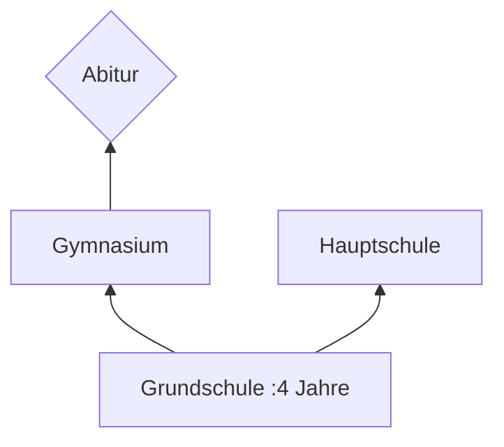

## 🔰Vokabeln
###  Text 1

| DEUTSCH                          | ENGLISCH                          | INFO     |
| -------------------------------- | --------------------------------- | -------- |
| bisher                           | so far                            |          |
| die  Schulzeit,-en                | school days                       |          |
| der Vortrag,-träge               | lecture,talk                      |          |
| der/die  Beamte                       | official,citizen server           | wie Adj. |
| die  Verwaltung,-en               | administration,admin              |          |
| damals                          | adv.then,at the time,at that time |          |
| die  Stadtverwaltung,-en          | city administration               |          |
| die  Ausbildung,-en               | training,education                |          |
| die  Kindergärtnerin,-nen         | kindergarten teacher              |          |
| die  Grundschule,-n               | primary school                    |          |
| beenden                          | to end                            | +Akku.   |
| das Abitur                       |                                   |          |
| die  Politologie                  | political science                 |          |
| die  Soziologie                   | sociology                         |          |
| theoritisch                      | theorical                         |          |
| wechseln                         | to change,switch,shift            | +Akku.   |
| das Studienfach,-fächer          | field of study                    |          |
| das Nebenfach,-fächer            | subsidiary subject                |          |
| die  Volkswirtschaft              | economy                           |          |
| bevor                            | conj. before                      |          |
| die  Hochschulaufnahmeprüfung,-en | college entrance exam             |          |
| per                              | prep. via                         | +Akku.   |
| der Lebenslauf,-läufe            | Resüme                            |          |
| die  Jobsuche,-n                  | job seeking                       |          |
| während                           | conj. during                      |          |
| verdienen                        | to earn                           | +Akku.   |
| literarisch                      | adj. literal                          |          |
| am liebsten                      | best                              |          |
| der Kulturaustausch,-täusche     | cultural exchange                 |          |
| die  Vergangenheit,-en            | past                              |          |
| die  Zukunft                      | future                            |          |
| die  Gegenwart                    | present                           |          |
| nämlich                          | namely                            |          |
| das Kraftfahrzeug,-e             | vehicle                           | Abk: Kfz |
| der Machaniker,-                 | machinist                         |          |
| der Sprachkurs,-e                | language course                   |          |
| das Interesse,-n                 | interest                          |          |

![[052 L6 Vokabeln-T1.mp3]]
___
### Text 2

| DEUTSCH                      | ENGLISCH                         | INFO   |
| ---------------------------- | -------------------------------- | ------ |
| die  Radiosprecherin,-nen     | radio speaker                    |        |
| die  Fernsehansagerin,-nen    | tv announcer                     |        |
| die  Malerim,-nen             | drawer                           |        |
| das Ministerium,Ministrerien | ministry                         |        |
| das Fragezeichen,-           | question mark                    |        |
| die  Umfrage,-n               | survy,poll,questionary           |        |
| das Studienjahr,-e           | academic year                    |        |
| da                           | conj.as,because,since            |        |
| die  Politik                  | politics                         |        |
| weil                         | conj.because                     |        |
| fachlich                     | adj.professional,technic         |        |
| mutig                        | adj.bold,brave                   |        |
| realistisch                  | adj.realistic                    |        |
| die  Geschäftswelt,-en        | business world                   |        |
| hart                         | adj.hard,tough                   |        |
| der Kampf,Kämpfe              | fight,combat,struggle            |        |
| der Konkurrenzkampf,-kämpfe  | (business)competition            |        |
| der Außenhandel              | foreign trade                    |        |
| spannend                     | adj.exciting,thrilling           |        |
| aufregend                    | adj.exciting                     |        |
| die  Meinung,-en              | idea                             |        |
| der Plan,Pläne               | plan                             |        |
| durch/setzen                 | to enforce,impose                |        |
| sich durch/setzen            | to reach a goal                  |        |
| fest                         | adj.&adv.firm                    |        |
| erleben                      | to experience                    | +Akku. |
| das Fachwissen               | expertize,professional knowledge |        |
| technisch                    | technical                                 |        |
![[053 L6 Vokabeln-T2.mp3]]
___
### Text 3

| DEUTSCH                    | ENGLISCH         | INFO                     |
| -------------------------- | ---------------- | ------------------------ |
| der Held,-en 🦸‍♂️         | hero             |                          |
| Top Ten                    |                  |                          |
| die  Jugend                 | youth            |                          |
| die  Jugendforschung,-en    | youth research   |                          |
| die  Tierärtztin,-nen        | vet              |                          |
| die  Tierpflegerin,-nen     | animal keeper    |                          |
| das Model,-s               | model            |                          |
| die  Friseurin,-nen         | hairdresser      |                          |
| die  Sängerin,-nen 👨‍🎤    | singer           |                          |
| die  Stewardess,-en   👩‍✈️ | stewardess       |                          |
| der Pilot,-en,-en 👨‍✈️    | pilot            | #🚨Achtung n-deklination |
| der Lastkraftwagen,-   🚛  | truck            |                          |
| der Astronaut,-en,-en      | astronaut        | #🚨Achtung n-deklination |
| der/die  Jugendliche        | the youth        | wie Adj.                 |
| auseinander liegen         | break up         |                          |
| der Traum,Träume           | dream            |                          |
| gegenüber/stehen            | to face,confront | +Dat.                    |
| das Image,-s               | public image     |                          |
| traditionell               | traditional      |                          |
| die  Erziehung,-en          | education        |                          |
| die  Krankenpflege          | nursing          |                          |
| ändern                     | to change        | +Akku.                   |
| sich ändern                | sth. changes     |                          |
| der Teenager,-             | teenager         |                          |
| das Klischee,-s            | cliché           |                          |
| unbegabt                   | adj.untalented   |                          |
| jm./etw. Platz machen     | make room for..  |                          |
| die  Sicherheit             | security         |                          |
| die  Hitliste,-n            | hit list         |                          |
| die  Ingenieurin,-nen       | engineer         |                          |
| die  Wahl,-en               | choice           |                          |
| die  Berufswahl,-en          | career choice    |                          |
![[054 L6 Vokabeln-T3.mp3]]
___
### Grammatik

| DEUTSCH                        | ENGLISCH            | INFO |
| ------------------------------ | ------------------- | ---- |
| halten,hält,hielt,hat gehalten | to hold             |      |
| einen Vortrag halten           | make a presentation |      |
| der Popstar,-s                 | pop star            |      |
| die  Diskussion,-en             | discussion          |      |
![[055 L6 Vokabeln-Grammatik.mp3]]

___
## 📄Texte
### T1 : Mein Leben
- Yang Fang: Du, Anna, im Deutschunterricht soll morgen jeder erzählen, was er bisher gemacht hat, über seine Schulzeit und so. Erzähl doch bitte mal von dir. Dann weiß ich, was man da so sagt.

- Anna: Gern, aber viel kann ich noch nicht berichten. Ich bin ja noch jung. Also, mein „Vortrag" :Ich heiße Anna Schubert und bin 1984 in Potsdam geboren. Mein Vater ist Beamter in der Stadtverwaltung, meine Mutter arbeitete damals als Sekretärin. Sie machte dann noch eine Ausbildung und ist jetzt Kindergärtnerin. Von 1990 bis 1994 war ich wie jedes Kind in der Grundschule, ab der fünften Klasse besuchte ich das Gymnasium in meiner Heimatstadt. In der 13. Klasse beendeten wir mit dem Abitur die Schule. Seit drei Jahren bin ich Studentin. Im ersten Jahr studierte ich , Politologie und Soziologie in Berlin, aber das war mir zu theoretisch. Ich wechselte mein Studienfach und studiere nun Sinologie. China interessierte mich schon als Schülerin. Zwei Semester lang lernte ich an der Humboldt-Universität Berlin Chinesisch. Seit dem letzten Wintersemester besuche ich die Beijing Universität. Ich studiere im Nebenfach Volkswirtschaft und möcht später für eine deutsche Firma in China arbeiten.

- LiTao: Ein guter Vortrag, danke, ich habe alles verstanden. Bevor du dein Studienfach gewechselt hast, musstest du da eigentlich noch mal eine Hochschulaufnahmeprüfung machen?

- Anna: Nein, ich brauchte keine Hochschulaufnahmeprüfung. Mit dem Abitur darf man in Deutschland studieren.

- Yang Fang: Und wie war das bei dir, Thomas?

- Thomas: Li Tao hat mir schon von eurem Vortrag erzählt und ich habe ihm per E-Mail meinen Lebenslauf <mark style="background: #ADCCFFA6;">geschickt</mark>.

> [!NOTE] schenken und schiken
> 1. Schenken: Das Verb "schenken" bedeutet, jemandem etwas freiwillig und ohne Gegenleistung zu übergeben oder zu geben. Es wird oft im Kontext von Geschenken verwendet, bei denen man jemandem etwas gibt, um Freude oder Wertschätzung auszudrücken. Zum Beispiel: "Ich schenke meiner Mutter eine Kette zum Geburtstag" oder "Er hat mir ein Buch geschenkt".
> 2.  Schicken: Das Verb "schicken" bedeutet, etwas oder jemanden an einen bestimmten Ort zu senden oder zu bringen. Es wird verwendet, um auszudrücken, dass man jemanden oder etwas an einen anderen Ort schickt. Zum Beispiel: "Ich schicke dir eine E-Mail" oder "Sie hat mich zum Arzt geschickt".

- LiTao: Ja, danke, ich habe ihn bekommen und schickte ihn gleich weiter an Yang Fang. Aber ich habe noch eine Frage. Du interessierst dich für Kunst und Literatur. Was willst du denn mal werden?

- Thomas: Eine gute Frage. Meine Jobsuche wird sicher schwierig. Während ich noch am Gymnasium war, wollte ich Schriftsteller oder Universitätsprofessor werden. Aber an den Unis gibt es fast keine freien Stellen. Und als Schriftsteller wirst du alt, bevor du was verdienst. Auch von literarischen Übersetzungen kannst du nicht leben. Jetzt möchte ich am liebsten etwas im chinesisch-deutschen Kulturaustausch machen: Ausstellungen und Konzerte veranstalten oder Besuche von Schriftstellern, Künstler und Wissenschaftlern organisieren. Auch der Studentenaustausch interessiert mich.

- Anna: Also Während ihr hier über die Vergangenheit und die Zukun redet, muss ich mich langsam um die Gegenwart kümmern. Ich habe nämlich Hunger. Wer kommt mit in die Mensa?

![[048 L6 T1 Mein Leben.mp3]]

> [!ABSTRACT] Title
> Contents

____
### T2 : Was will ich werden ? Was kann ich weden?
Einmal Radiosprecherin oder Fernsehansagerin, zweimal Malerin, dreimal eine Stelle an der Hochschule, dreimal Dolmetscherin oder Dolmetscher, dreimal eine Beamtenstelle in einem Ministerium, zehnmal ein Job in der Wirtschaft und viele, viele Fragezeichen - das ist das Ergebnis einer Umfrage zu Berufswünschen in einer Klasse von Germanistikstudenten im zweiten Studienjahr.

**Dai Sulin**
Da ich später mein Deutsch benutzen will, ist Dolmetscherin und Ubersetzerin mein Berufsziel. Aber bevor ich in diesem Beruf anfange, möchte ich noch ein anderes Fach studieren, z. B. Wirtschaft oder Politik, weil ein Dolmetscher auch fachlich gut sein muss.

**Viktoria Wang**
Ich möchte Journalistin und Künstlerin werden. Journalistin ist mein Berufsziel, weil man viele Menschen kennen lernt und die Welt sieht. Journalisten müssen kluge, moderne und mutige Menschen sein. Das ist auch mein Bild von der Frau von heute.

Mein wirklicher Traumberuf ist aber Künstlerin. Schon als Kind habe ich gern und gut gemalt. Aber dieser Berufswunsch ist nicht realistisch, weil man als Malerin wenig Geld verdient und kein leichtes Leben hat. Ich muss also in zwei Berufen arbeiten.

**Zhu Zheying**
Früher habe ich mich für Wirtschaft interessiert und wollte in einer Firma arbeiten, weil man da viel Geld verdienen kann. Aber jetzt möchte ich an der Uni bleiben und Professorin werden.

In der Geschäftswelt gibt es viele unsympathische Typen. Ich habe auch Angst vor dem harten Konkurrenzkampf. An der Universität ist das Leben ruhig. Man kümmert sich um das Studium, um Wissenschaft und Kultur. Das gefällt mir.

**Gao Feng**
Da ich mich sehr für Verwaltung und Wirtschaft interessierte, möchte ich Chef einer Außenhandelsfirma werden. Diese Arbeit ist spannend und aufregend. Als Chef ist man frei und kann seine Meinungen und Pläne durchsetzen.

**Zhong Wenxi**
Für mich gibt es keinen Traumjob. Ich möchte auch keine feste Stelle haben, weil es langweilig ist, wenn man immer nur eine Arbeit macht. Ich will viel erleben. Vielleicht kann ich später als Reiseleiterin, Dolmetscherin, Angestellte und Lehrerin arbeiten.

![[049 L6 T2 Was will ich werden - Was kann ich werden.mp3]]
___
### T3 : Jugend träumen von Helden,Märchen vom Helfen
**DIE TOP TEN DER TRAUMBERUFE**
Das Deutsche Institut für Jugendforschung fragte 1000 Kinder im Alter zwischen 6 und 14 Jahren danach, was sie einmal werden wollen.
![[IMG_7014.jpg]]
Model oder Polizist,Lkw-Fahrer oder Astronaut, die Traumjobs deutscher Kinder und Jugendlicher liegen weit auseinander.Doch er gibt Trends : 

Die Märchen sind <mark style="background: #ADCCFFA6;">eher</mark> realistisch , die Jugend eher Träumer. Das zeigt besonders Platz 1 unter den Top Ten der Berufsziele : Da steht die Tierärztin <mark style="background: #D2B3FFA6;">dem Fußballstar gegenüber</mark>. Aber auch den Märchen geht es ums Image eines Berufs - Model , Sängerin und Stewardess sind ebenso Imageberuf wie Fusballspieler,Pilot und Astronaut.

> [!note] Notizen
> eher = rahter
> *Dativ* + gegeüber

Außerdem haben die kinder noch die Traditionellen <mark style="background: #FF5582A6;">Vorstellung </mark>von Männer- und Frauenberufen : Berufe in der Erziehung oder Krankenpflege wie Lehrerin, Ärtztin oder Krankenschwester nennen die Technik wichtiger. <mark style="background: #ADCCFFA6;">So finden sich auf Platz 3 bis 5 Pilot,Kfz-Mechaniker und Computer-Berufe</mark>.

> [!note] Notizen
> Das Nomen *Vorstellung* hat viele Bedeutungen.z.B. presentation, concept and introduction
> 

Die Berufswünsche ändern sich , wenn die Teenager älter werden. Das zeigte eine neue Untersuchung der Universität Jena. Die Klischees, dass Mädchen technisch unbegabt sind und dass Erziehung und Krankenpflege nichts für Männer sind, hört man weniger. Und viele Träume machen realistischen Plänen Platz, vor allem dem Wunsch nach Sicherheit und Geld. So verlassen die Stars die Hitliste und die Ingenieurinnen und Ingenieure kommen.

> [!note] Notiz
> die Untersuchung : survey

![[051 L6 T3 Jungen taeumen von Helden,Maedchen vom Helfen.mp3]]
____
## Wörter
### W1 : Wortfield *Beruf*

|                   |                 |                  |                |
| ----------------- | --------------- | ---------------- | -------------- |
| der Dolmetscher,- | der <mark style="background: #ABF7F7A6;">Chirurg</mark>,-en | das Model,-s     | der Lehrer,-   |
| der Pfleger,-     | der Koch,Köche  | der Übersetzer,- | der Friseur,-e |
| der Maler,-       | der Ansager,-   | der Sekretär,-e  | der Ober,-     |

### W2 : Wortbildung : Vern --> Nomen

#### 1. Nomen = Verb ---> Nomen

| Verb        | Person(Männlich)  | Person(weiblich)       |
| ----------- | ----------------- | ---------------------- |
| lehren      | der Lehrer,-      | die Lehrerin,-nen      |
| arbeiten    | der Arbeiter,-    | die Arbeiterin,-nen    |
| fahren      | der Fahrer,-      | die Fahrerin,-nen      |
| dolmetschen | der Dolmetscher,- | die Dolmetscherin,-nen |
| übersetzen  | der Übersetzer,-  | die Übersetzeron,-nen  |
| malen       | der Maler,-       | die Malerin,-nen       |
| pflegen     | der Pfleger,-     | die Pflegerin,-nen     |
| leiten      | der Leiter,-      | die Leiterin,-nen      |
| besuchen    | der Besucher,-    | die Besucherin,-nen    |
| forschen    | der Forshcer,-    | die Forscherin,-nen    |
| vermieten   | der Vermieter,-   | die Vermieterin, -nen  |
| einbrechen   | der Einbrecher,-  | die Einbrecherin,-nen  |

***Aber*** : 

| Verb      | Person(Männlich) | Person(weiblich)     |
| --------- | ---------------- | -------------------- |
| laufen    | der Läufer,-     | die Läuferin,-nen    |
| rauben    | der Räuber,-     | die Räuberin,-nen    |
| verkaufen | der Verkäufer,- | die Verkäuferin,-nen |
| backen    | der Bäcker,-     | die Bäckerin,-nen    |
___
### W3 : 5 X da
#### 1. Als lokale Ergänzung oder Angabe oder als Teil davon
- Da ist unsere Bibliothek.
- Da hinten sind die Hörsäle
- Und da rechts kann man die Mensa sehen.

#### 2. als Attrribut
- Das Haus da ist unsere Deutschabteilung.
- Die Studentin da studiert Tiermedizin.

#### 3. rückweisend auf Ort oder Zeit
- Warst du oft in der Gemäldeausstellung ?
- Nein, da war ich nur einmal.

- Hast du morgen Abend Zeit ?
- Nein , da muss ich in die Vorlesung.

- Ich wolte gerade aus dem Haus gehen.
- da klingelt Mein Handy.

#### 4. da= in dieser Situation
- An der Uni haben viele eine Virusinfektion.
- Da musst du aufpassen, dass du dich nicht ansteckt.

- Kannst du mir diese Mathematikaufgaben erklären?
- Nein, da kann ich dir leider nicht helfen.Ich bin da bestimmt nicht besser als du.

#### 5. da = weil
- Da er Fieber hat,muss er inm Bett bleiben.

- Er muss früh aufstehen,da er morgen das Frühstrück macht.

___

## 🚦Grammatik

### G1 : Das Präteritum : Regelmäßig Verben
#### 1. Formen
machen

|           |                                                                    |     |                                                                   |
| --------- | ------------------------------------------------------------------ | --- | ----------------------------------------------------------------- |
| ich       | machte                                | wir | machten |
| du        | machtest | ihr | machtet |
| er/sie/es | machte                                | sie | machten |
| Sie       | machten  |     |                                                                   |

> [!tip] Für Besseres Gedächnis
> 3.Person in der Gegenwartform + **e**

#### 2. Gebrauch
##### Perfekt
1. Für Gespräche und Unterhaltungen
> [!warning] Ausnahmen
> - *haben*
> - *sein*
> - Modalverben

2. Zum Ausdruck der Vorzeitigkeit in Gegenwart und <mark style="background: #ABF7F7A6;">Zukunft</mark>.  
> Wenn ich mein Studium beendet habe,möchte ich nach Deutschland 🇩🇪 fahren.

##### Präteritum
1. Für das Erzählen von Vergangenem (Geschichten,Märchen ,Anedoten usw.)
2. Für das Scheiben von Literatur (Roman,Novellen usw.) und Zeitungsartikeln.
3. Bei Modalverben ,bei *haben* und *sein.*

### G2 : Der Kausalsatz mit *weil* und *da*
- Ich will Kindergärtnerin werden, weil ich mich gern um Kinder kümmern.
- Ich will Schriftsteller werden,weil ich da zu Hause arbeiten kann.
- Ich will Dolmetscherin werden, weil ich leicht Fremdsprachen lerne.
- Ich will Tierärztin werden,weil ich sehr tierlieb bin.
- Ich will Politiker werden,weil ich meine Meinung durchsetzen kann.
- Ich will Geschäftsman werden,weil ich so viel Geld verdienen kann.
- Ich will Fußballspieler werden,weil ich so mein Hobby,den Sport,zu meinem Beruf machen kann.
- Ich will Sängerin werden,weil ich Popstars toll finde.

| Hauptsatz                          | Subjunktor | Nebensatz                                                             |
| ---------------------------------- | ---------- | --------------------------------------------------------------------- |
| Sie studiert Sinologie,            | weil/da    | sie sich für China interessiert.                                      |
| Ihr Nebenfach ist Volkswirtschaft, | weil/da    | sie nach dem Studium für eine deutsche Firma in China arbeiten will . |

| Subjunktor | Nebensatz                 | Hauptsatz                     |
| ---------- | ------------------------- | ----------------------------- |
| Weil/Da    | ich starkes Fierber habe, | kann ich nicht kommen.        |
| Weil/Da    | er gestern stark regnete, | mussten wir zu Hause bleiben. |

1. Weil und da haben als Subjunktoren in Kausalsätzen fast die gleiche Bdeutung.
2. Der Kausalsatz mit *da* ist seltener und steht oft vor dem Hauptsatz.
3. Wenn auf eine *warum-* Frage nur mit Kausalsatz geantwortet wird,verwendet man *weil*.  #🚨Achtung 
> - Anna, warum jast du dein Studienfach gewechselt?
> - Weil ich mich schon immer für China interessiert habe.

### G3 : Temorale Angabesätze mit *während* und *bevor*

| Angabensätze            | Nebensätze     |
| ----------------------- | -------------- |
| Während er frühstrückt, | hört er Radio. |
| Bevor er frühstrückt,   | treibt er etwas Morgensport.               |

- Während bezeichnet normalerweise zwei Abläufe, die parallel verlaufen. Es kann aber auch einen Gegensatz zwischen Hauptsatz und Nebensatz andeuten, wie in den Sätzen 4, 5, 6. Manchmal bezeichnet der während-Satz nur einen Gegensatz ohne die Gleichzeitigkeit, z. B: Während es gestern schön war, regnet es heute.
- Wahrend 带起的从句一般表示和主句平行的行为。但有时在表示同时性之外也表示主从句行为的对立，如上面的4，5，6句。在某些情况下只表示对立，而不表示同时性，如上面的例句：昨天天气还很行，今天却下雨了。

> [!caution] Tipp
> *während* im Deutschen und *while* im Englischen haben fast gleiche Bedeutung.

## 🧭 Übung
### Ausbildungssystem in Deutschland 🇩🇪 

#### Übersetzung
1. Meine Eltern wollen, dass ich in die Universität gehen und Ingenieur werden.Aber ich wieß doch nicht, ob ich die Hochschuleaufnahmeprüfung bestehen kann.
2. Hans studiert in einem Gymnasium und hat gute Markte bekommen. Sobald er abschluss macht , bekommt er einen Studienplatz für Medizin an der Universität München. Seine Schwester ist jetzt in der Realschule. Sie möchte Krankenschwester oder Arzthelferin werden.Aber wenn sie ziemlich gute punkte hat , geht sie doch auch in die Fachoberschule und nimmt doch das Fachabitur. Danach kann sie in eine Fachhochschule gehen und Sozialarbeiterin werden.
3. Viele mädchen wollen Stewardess oder Modelle werden, aber der Traumberuf meiner Tochter ist Fernsehen- oder Radiosprecherin
_____
1. Meine Eltern wollen, dass ich auf die Universität gehe und Ingenieur werde, aber ich weiß nicht, ob ich die Aufnahmeprüfung für die Universität bestehen kann.
2. Hans besucht ein Gymnasium und hat gute Noten bekommen. Wenn er fertig ist, bekommt er einen Studienplatz für Medizin an der Universität München. Seine Schwester besucht jetzt die Realschule. Sie will Krankenschwester oder Arzthelferin werden, aber wenn sie gute Noten hat, kann sie auch auf die Fachoberschule gehen und das Fachabitur machen. Dann kann sie auf die Fachhochschule gehen und Sozialarbeiterin werden.
3. Viele Mädchen wollen Stewardess oder Model werden, aber der Traumberuf meiner Tochter ist Fernseh- oder Radiosprecherin. 