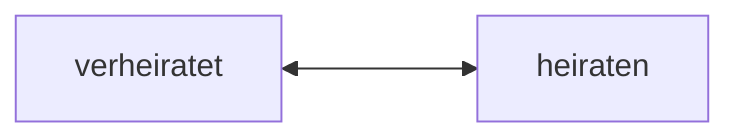

## 🔰Vokabeln
### Text 1

| DEUTSCH                         | ENGLISCH             | INFO                |
| ------------------------------- | -------------------- | ------------------- |
| lassen                          |                      |                     |
| der Alltag                      | everyday life        |                     |
| alltäglich                      | everyday             |                     |
| die  Scene,-n                    | scene,situation      |                     |
| gucken                          | to look,peek         | +Akku.              |
| rechtzeitig                     | adj. timely,punctual | ~= pünktlich        |
| aus/fallen                      | to cancel            |                     |
| los/müssen                      | have to leave        |                     |
| irgendwas (ugs.)                | something            | =irgendewas         |
| die  Matheaufgabe,-n             | math homework        | =Mathematikaufgabe  |
| sobald                          |                      |                     |
| solange                         |                      |                     |
| nennen,nennt,nannte,hat genannt | co call,name         | +Akku./sich+N./Adj. |
| halbtags                        | adv. half of the day |                     |
| die  Spagetti  (Pl.)             | Spagetti             |                     |
| die  Soße,-n                     | sauce                |                     |

![[071 L8 Vokabeln-T1.mp3]]
____
### Text 2

| DEUTSCH                                                      | ENGLISCH               | INFO     |
| ------------------------------------------------------------ | ---------------------- | -------- |
| die  Form,-en                   | form                   |          |
| das Paar,-e                     | couple                 |          |
| das Ehepaar,-e                  | couple                 |          |
| der Anteil,-e                   | share,portion,amount   |          |
| der Dink,-s                     | dink                   |          |
| betragen,-trägt,-trug,hat -tragen                            | to amount,amount to    |          |
| die  Partnerschaft,-en          | partnership            |          |
| zusammen/ziehen                                              | move to live together  |          |
| heiraten                                                     | to marry               | +Akku.   |
| ledig                                                        | adj. single            |          |
| die  Lebensgemeinschaft, -en     | cohabitation           |          |
| steigen,steigt,stieg,hat gesteigen                           | to increasr,rise,climb |          |
| die  Ehe,-n                     | marriage               |          |
| sich entschließen ,entschließt,entschloss,hat entschlossen | to make up mind        | +zu      |
| sich scheiden lassen                                         | to divorce             |          |
| die  Scheidung,-en              | divorce                |          |
| die  Folge,-n                   | result                 | das Ergebnis,-se         |
| der/die  Alleinerziehende       | single-parented        | wie Adj. |
| heran/wachsen,wächst heran,wuchs heran,ist herangewachsen       | to grow up             |          |
| das Patchwork,-s                |                        |          |
| der Trend,-s                    | trend                  |          |
| häufig                                                       | adj.&adv.frequent(ly)  |          |
| der Single,-s                                                | single                 |          |

![[072 L8 Vokabeln-T2.mp3]]

> [!note] Folge
> = das Resultat,-e
> = das Ergebnis,-se

> [!warning] Wachsen
> wachsen : to grow, expand
> wachsen : to wax , regelmäßig

____
### Text 3

| DEUTSCH                                | ENGLISCH                    | INFO   |
| -------------------------------------- | --------------------------- | ------ |
| der Trauschein, -e                         | marriage certificate        |        |
| der Talk,-s                            | talk                        |        |
| die  Talkrunde,-n                       | chat show participant       |        |
| die  Talkshow,-s                        |                             |        |
| der Moderator,-en,-en                      | moderator                   |        |
| zu Wort kommen                         | get a chance to speak       |        |
| das Motto,-s                           | motto                       |        |
| wild                                   | adj. wild                    |        |
| moralisch                              | adj. moral                       |        |
| längst                                 | adv.long                    |        |
| tolerieren                             | tolerate                    | +Akku. |
| die  Gesellschaft,-en                   | society                     |        |
| nichtehelich                           | adj.illigimate              |        |
| die  Tatsache,-n                        | reality,truth               |        |
| konkret                                | adj.concret,tangible        |        |
| lösen                                  | to solve                    |        |
| meiner Meinung nach...                 | my opinion about            |        |
| ab/lehnen                              | to reject,refuse            |        |
| auseinander gehen                      | to break,up                 |        |
| deshalb                                | adv. so,thus                |        |
| stabil                                 | adj. &adv. stable           |        |
| das Argument,-e                        | argument                    |        |
| kinderlos                              | childless                   |        |
| verbreitet                             | adj.wildspread,poplular     |        |
| die  Trennung,-en 💔                    | breakup                     |        |
| trennen                                | to seperate,discconnect     | +Akku.       |
| getrennt                               | adj.apart                   |  |
| die  Stabilität, -en                     | stability                   |        |
| die  Probe, -n                           | sample,test,speciment       |        |
| Ehe auf Probe                          | mariage on trial            |        |
| entstehen,entseht,entstand,entstanden | to result,arise             |        |
| verliebt                               | in love                     |        |
| verlobt                                | engaged                     |        |
| verheiratet                            | marrieg                     |        |
| die  Verlobung,-en                      | engagement                  |        |
| die  Probezeit,-en                      | trial period                |        |
| die  Heirat,-en                         | marriage                    |        |
| zueinander                             | adv. together               |        |
| die  Runde,-n                           | circle,group                |        |
| fallen,fällt,fiel,ist gefallen         | to fall                     |        |
| das Wort ist nicht gefallen            | No one mentioned that word. |        |
| die  Toleranz                           | tolerence                   |        |
| die  Sendung,-en                        | program,show                |        |
| das Schlusswort,-e                 | closing words               |        |
| zu/shauen + Dat.                       | to watch                    |        |
| der Leistungssport                     | competitive sport           |        |

> [!note] gefallen vs fallen
> ist gefallen --> fallen
> hat gefallen --> gefallen

> [!note] *Wort,Wörte* vs *Wort,Wort*
> Wort,Wörte == "word" in English
> Wort,Worte == "a speech" to say in English

![[073 L8 Vokabeln-T3.mp3]]

 
______
### Wörter

| DEUTSCH     | ENGLISCH | INFO |
| ----------- | -------- | ---- |
| der Ring,-e | ring     |      |

____
### Grammatik

| DEUTSCH                 | ENGLISCH                     | INFO             |
| ----------------------- | ---------------------------- | ---------------- |
| unbedingt               | adj.&adv. absolute(ly)       |                  |
| der Regenmantel,-mäntel | raincoat                     |                  |
| heiß 🥵                 | adj. hot                     |                  |
| offnen                   | adj. open                    |                  |
| nah(e)                  | close                        |                  |
| das T-Shirt,-s 👕       | t-shirt                      |                  |
| jedenfalls              | adv.in any case              | = auf jeden Fall |
| jedoch                  | adv. though,having said,that |                  |
| beruflich               | adj. professional            |                  |

![[074 L8 Vokabeln-Woerter.mp3]]
___
## 📄Texte

### T1 : Familienalltag in sieben Szenen
- 👩 :Du, Andreas, gehen wir doch noch ein Glas Wein trinken.
- 💁🏼‍♂️ :Lust habe ich schon, aber die Kinder ... Hallo, Fabian, komm mal her. Du, Mutti und ich wollen noch kurz weggehen. <mark style="background: #ADCCFFA6;">Pass doch bitte auf die Kleine auf</mark>, bis wir wieder zurück sind. Um neun muss sie im Bett sein.
- 👦🏿 Darf ich noch ein bisschen Fernsehen gucken? 
- 💁🏼‍♂️:Ach, immer fernsehen. Spiel lieber mit Annika. Aber schick sie rechtzeitig ins Bett. Nicht später als neun!
_____

- 👩 :Aufstehen, Fabian, es ist schon sieben.
- 👦🏿: <mark style="background: #ABF7F7A6;">Aber heute fällt doch die erste Stunde aus.</mark>
- 👩: Tut mir Leid. Annikas Kindergarten fängt um acht an.Und um neun kommen die Leute mit Zahnweh zu mir.
-  👦🏿: Lass mich doch mal allein in die Schule fahren, Ich bin schon in der dritten Klasse.
- 👩: Mit dem Bus brauchst du viel länger als mit dem Auto. Da musst du auch gleich los.
- 👦🏿: Aber wenn ich älter bin, darf ich mit dem Fahrrad fahren.
- 👩: Mal sehen.

> [!tip] Stunde = class/lesson

_________

- 👩:Na, wie war's im Kindergarten?
- 👧🏻:Ein bisschen langweilig. Frau König hat uns die ganze Zeit allein spielen lassen.
- 👩: Lässt sie euch oft alleine spielen?
- 👧🏻:Nö. Aber heute hat sie irgendwas schreiben müssen.
_________

- 👦🏿: Mutti, kannst du mal meine Matheaufgaben anschauen?
- 👩:Sobald ich mit dem Kochen fertig bin, komme ich.
_________

- 👩:Wie spät ist es denn?
- 💁🏼‍♂️:Erst sechs. Schlaf noch eine Stunde. Ich muss zum Bahnhof. Tschüss, Elke.
- 👩:Tschüss, bis heute Abend.
_________
- 👦🏿:Ich hör sie kommen. Mach schnell den Fernseher aus.
- 👧🏻:Und du, geh sofort ins Bett!
_________
- 👩:Tag. Du kommst aber spät.  
- 💁🏼‍♂️:Ja, es war wieder zu viel los in der Firma. Und da habe ich den Halb-sechs-Uhr-Zug nicht mehr geschafft.
- 👩:Andreas, du arbeitest zu viel.
- 💁🏼‍♂️:Weiß schon. Aber solange wir keinen zweiten Bauingenieur haben, wird es nicht besser. Und wie war's in der Praxis?
- 👩:Über 30 Patienten wieder. Um drei Uhr war ich erst fertig.
- 💁🏼‍♂️:Und so was nennt sich Halbtagsjob. - Was gibt's denn zu essen?
- 👩:Ach, nur Spagetti mit Soße aus der Dose. Als ich mit den Kindern endlich zu Hause war, hatte ich keine Lust mehr zum Einkaufen.
- 💁🏼‍♂️:Spagetti sind schon ok. - Warte, Elke, ich helf den Tisch decken.
- 👩:<mark style="background: #CACFD9A6;">Lass mich nur machen. Ruh dich ein bisschen aus.</mark>

![[065 L8 T1 Familienalltag in sieben Szenen.mp3]]

#### Ü5
###### 1.
Schäfers wohnen bei/in der Nähe von Düsseldorf. Herr Schäfer ist Bauingenieur in Essen. Frau Schäfer ist Zahnarzthelferin, sie arbeitet von neun bis eins. Nach der Geburt von Fabian hat sie mit dem Beruf aufgehört. Aber seit zwei Jahren arbeitet sie wieder. Sie braucht den Beruf, denn sie will nicht nur Hausfrau und Mutter sein. Das bedeutet aber sehr viel Arbeit für sie. Sie muss sich fast allein um die Kinder kümmern, denn ihr Mann kommt meistens erst nach sieben Uhr abends nach Hause.

Fabian kann und muss bei der Hausarbeit schon ein bisschen mithelfen. Er kann zum Beispiel aufräumen und Geschirr abwaschen.

Die Eltern sagen, dass sie ziemlich tolerant sind und den Kindern viel Freiheit lassen. Aber Ordnung und Pünktlichkeit sind wichtig, weil beide Eltern <mark style="background: #FFB86CA6;">berufstätig</mark> sind.

###### 2.
Das Verhältnis zwischen Eltern und Kindern ist ziemlich gut. Frau Schäfer hält ihre Familie für glücklich.Aber Herr Schäfer hat zu wenig Zeit für die Familie und Frau Schäfer muss die ganze Hausarbeit machen.

Das ist neben inrem Bernt sehr vie Arbeit. Aber sie wil nicht nur Hausfrau und Mutter sein.
Die Eltern sind ziemlich tolerant und lassen den Kindern recht viel Freiheit. Jeder hat seine Hobbys. Aber die Eltern sind beide berufstätig und die Mutter hat viel zu tun, so muss Fabian bei der Hausarbeit mithelfen. Das gefällt ihm nicht besonders. Außerdem ist Fabian auch etwas unzufrieden, dass er nicht viel fernsehen darf,

____
### T2 : Lebensformen
Die „Normalfamilie" - ein Ehepaar mit einem oder mehr gemeinsamen Kindern - wird in Deutschland immer seltener. Weniger als ein Viertel der deutschen Haushalte ist in diesem Sinn normal. Etwas größer ist inzwischen schon der Anteil der Ehepaare ohne Kinder. Die meisten von ihnen sind Dinks. Für sie sind Beruf, Geld und Freiheit wichtiger als Kinder.

Immer normaler, fast schon am normalsten sind in Deutschland Single-Haus-halte. <mark style="background: #ABF7F7A6;">Ihr Anteil beträgt mehr als ein Drittel und wird immer größer</mark>. Aber nicht nur Singles, das heißt Menschen ohne feste Partnerschaft, leben allein. Auch junge Paare wollen oft nicht gleich zusammenziehen und heiraten. Erst wenn ein Kind kommt, heiraten die meisten. Viele bleiben aber weiter ledig und nur in einer freien Lebensgemeinschaft zusammen. Auch ihr Anteil steigt, denn die Deutschen werden immer vorsichtiger (und auch alter), bevor sie sich zu einer Ehe entschließen.

Immer weniger heiraten, immer mehr lassen sich scheiden. Inzwischen enden etwa 50% der Ehen mit einer Scheidung. Eine Folge davon sind Alleinerziehende. Jedes fünfte Kind wächst nur bei der Mutter - seltener nur beim Vater - heran. Eine andere Folge der vielen Scheidungen sind Patchwork-Familien. Gemeint ist eine Partnerschaft mit Kindern aus einer früheren Ehe. Etwa 20% der deutschen Familien sind „Patchwork".

![[067 L8 T2 Lebensformen.mp3]]
______
### T3 : Ehe ohne Trauschein
Moderator: ... Lassen wir <mark style="background: #FF5582A6;">zunächst </mark>die Wissenschaft zu Wort kommen. Freie Partnerschaft oder Ehe? Bitte, Frau Dr. Hausmann.

Hausmann: Nichts beschreibt die Situation besser als das Motto dieser Talkshow „Leben und leben lassen". Die Zeiten, als man von wilder Ehe sprach und das freie Zusammenleben moralisch schlecht fand, sind vorbei. Längst toleriert die Gesellschaft diese Lebensform. Immer weniger Paare heiraten. Die nichteheliche Lebensgemeinschaft ist also eine Tatsache und es geht nicht mehr darum: Ist sie gut oder ist sie schlecht? Es geht darum: Welche Probleme gibt es konkret und wie kann man sie lösen?

Schäfer:<mark style="background: #FFB86CA6;"> Meiner Meinung nach geht es schon um gut oder schlecht.</mark> Ich lehne das Zusammenleben ohne Trauschein ab. Wenn es da mal zum Streit kommt, geht man gleich auseinander. Deshalb gibt es auch so viele
Alleinerziehende. Das ist nicht gut für die Kinder. Eine Ehe ist stabiler und sie gibt Sicherheit, besonders den Frauen.

Hausmann: Sicherheit ist ein wichtiges Argument, da haben Sie Recht. Deshalb ist das nichteheliche Zusammenleben besonders bei jungen, Kinderlosen Paaren verbreitet. Oft heiraten sie später, wenn Kinder kommen.

Moderator: Frau Schäfer sprach vom Problem der Alleinerziehenden. Das ist Ihre Situation, Herr Boettger. Vor drei Jahren haben Sie sich scheiden lassen, jetzt sind Sie alleinerziehender Single.

Boettger: Nicht ganz. Ich habe eine feste Freundin, aber wir leben nicht zusammen, noch nicht, …

Moderator: Noch nicht? Sie wollen also wieder heiraten?

Boettger: Das weiß ich nicht. Aber lassen Sie mich zuerst etwas zu den Argumenten von Frau Schäfer sagen. Jede Trennung der Eltern ist schlimm für ein Kind - ob die Eltern verheiratet waren oder nicht. Aber schlimmer ist es, wenn die Eltern dauernd streiten.Das war bei uns so. Ich bin sicher, meine Tochter ist jetzt bei mir allein glücklicher. Und nun zu Ihrer Frage, ob ich wieder heiraten möchte. Nach meiner Scheidung bin ich vorsichtiger geworden.Auf keinen Fall eine zweite Scheidung! So wie wir jetzt leben, sind meine Freundin und ich eigentlich ganz zufrieden. Wir fühlen uns freier, auch freier in unserer Beziehung.

Schäfer: Aber genau das meinte ich. Man kann sich zu leicht trennen, solange man nicht verheiratet ist. Erst die Ehe gibt Sicherheit und Stabilität.

Boettger: Meine Ehe war leider nicht stabil. Wir haben damals zu schnell
geheiratet. - Vielleicht ziehen meine Freundin und ich bald zu-sammen, aber das wird zuerst eine Ehe auf Probe. Dabei entsteht Sicherheit.

Schäfer: So ganz anders war das bei mir eigentlich auch nicht: verliebt -
verlobt - verheiratet. Mit der Verlobung begann auch eine Art Probezeit. Und bis zu unserer Heirat wurden mein Mann und ich immer sicherer, dass wir zueinander passen.

Moderator: Fragen wir die Jüngste in unserer Runde. Helen, Sie sind erst 17 und natürlich noch ledig. Wollen Sie mal heiraten?

Helen R.: Nun, ich will erst mal sagen, dass mir die Diskussion hier zu technisch ist. Sie reden von nichtehelichen Lebensgemeinschaften und Trauschein und Stabilität und so weiter. Aber kein einziges Mal ist hier das Wort Liebe gefallen. Und ich glaube, darum geht es. Hauptsache, man liebt sich. Wie man dann zusammenlebt, das sieht man schon. <mark style="background: #FFF3A3A6;">Persönlich bin ich nicht gegen eine Ehe.</mark> Wenn man sich liebt, dann soll man auch sagen, dass man das ganze Leben zusammenbleiben will. Ich finde es natürlich gut, dass die Gesellschaft in solchen Sachen tolerant ist.

Moderator: Toleranz, leben und leben lassen, der Titel unserer Sendung. Und
die Liebe nicht vergessen! Vielen Dank, Helen, das war ein schönes Schlusswort. Ich danke meinen Gästen hier am Tisch und Ihnen zu Hause fürs Zuschauen. Ich hoffe, in einer Woche sind Sie wieder dabei bei unserem nächsten Talk. Das Thema: „Leistungs-sport - Wo hört der Spaß beim Sport auf?" Auf Wiedersehen.

![[069 L8 T3 Ehe ohne Trauschein.mp3]]
## 📖Wörter
___
### W1 : Seine Meinung sagen
- Es geht (nicht) um...
- Meiner Meinung nach ...
- ich lehne ... ab
- das ist nicht gut
- das ist wichtig
- das ist schlimm
- schlimmer ist ...
- da haben Sie Recht
- das weiß ich nicht
- ich bin sicher
- auf keinen Fall
- das meinte ich
- Hauptsache ist...
- ich glaube
- ich bin gegen
- ich finde es gut

______
### W2 : Wortbildung
#### Familie + n + ...
- der Familienname 
- das Familientreffen
- das Familienfoto 
- das Familienglück 
- das Familienfest 
- die Familienfeier 
- das Familienleben 
- die Familienplanung 
- der Familienkrach

#### Ehe + ...
- der Ehemann 
- die Ehefrau 
- die Eheleute 
- die Ehepaar 
- der Ehepartner 
- die Ehepartnerin 
- der Ehering 
- das Eheleben
- das Eheglück der Ehekrach
______
### G3 : Wir eirderholen Verben

_______
### G4 : Adjektive mit den Suffixen *-ig,-lich,-isch*
___
## 🚦Grammatik
________________________
### G1 : das Verbe *lassen*
- Mutti, lässt du mich am Freitag zu Sarahs Party gehen?
- Ja, aber mit dem Fahrrad lasse ich dich nicht fahren. Und komm nicht wieder so spät nach Hause.
- Nein, nein, das Fahrrad lasse ich hier. Ich lasse mich von Rolf nach Hause bringen.  Ich rufe ihn gleich mal an.
- Lass nur, ich hole dich ab.
- Aber das ist wirklich nicht nötig.

#### 1. Bedeutung
##### *lassen* + Infinitiv
1. andere sollen etwas machen
- Ich lasse mir das buch bringen.
- <mark style="background: #FF5582A6;">Ich habe mir die Haare schneiden lassen.</mark> 💇‍♂️ 

2. erwas erlauben
- Die Eltern ließen die Kinder nicht ins Kino gehen.
- Sie lässt die Kinder oft allein spielen.
- Lass mich doch mal allein in die Schule gehen.

##### *lassen* als Verb
1. etwas nicht tun
- <mark style="background: #FFB8EBA6;">Lass nur.</mark> = auf englisch *forget it*
- Lass bitte das Rauchen.
- Er kann das Trinken nicht lassen.

2. etwas oder jemand nicht mitnehmen
- Ich kann das Kind nicht allien zu Hause lassen.
- Wo hast du denn dein Handy gelassen?

3. in Wendungen
- Lasst den Papa in Ruhe.Er musst noch arbeiten.

#### 2. Formen
##### Präsens

| Infinitiv  | lassen |
| ---------- | ------ |
| ich        | lasse  |
| du         | lässt  |
| er/sie/sie | lässt  |
| wir        | lassen |
| ihr        | lasst  |
| sie        | lassen |
| Sie        | lassen |

##### Prateritum 

| Infinitiv | ließ   |
| --------- | ------ |
| ich       | ließ   |
| du        | ließt  |
| er/sie/es | ließ   |
| wir       | ließen |
| ihr       | ließt  |
| sie       | ließen |
| Sie       | ließen |

##### Perfekt #⭐Wichtig 
| lassen als Vollverb : haben+gelassen               | lassen + Infinitv : haben + Infinitv + lassen         |
| -------------------------------------------------- | ----------------------------------------------------- |
| Sie hat das Kind allein zu Hause gelassen.         | Ich habe mir einen Rock machen lassen.                |
| Sie sagte,dass sie das Kind zu Hause gelassen hat. | Sie sagte,dass sie sich einen Rock hat machen lassen. |

> [!warning] Modalverben im Perfekt
> **Situation 1** : Modalverb als Vollverb
> 	haben + Modalverb (im Partizip II)
> 	Ich kann Deutsch.  <--> Ich habe Deutsch gekonnt.
> **Situation 2** : Modalverb mit Infinitiv
> 	Du darfst hier nicht rauchen. <--> Du hast hier nicht rauchen dürfen.
> 	Aber in Nebensäten : haben + Infinitiv + Modalverb(Partizip II)
> 	z.B.
> 	 ....,weil ich zu Hause Geige **habe spielen gedurft**.  

____
### G2 : Der Infinitiv ohne zu
#### 1. Als Ausdruck einer Aufforderung 
1. Solche Aufforderungen sind meistens an die Allgemeinheit gerichtet,nicht eine bestimme Person.
- Bitte Ort und Datum nicht vergessen.
- Rechts fahren! links fahren!

2. Wenn diese Aufforderungen an bestimme Personen gerichtet sind, wirken sie oft nicht sehr freundlich.
- Kinder, auftehen.
- Alle mal aufpassen.

#### 2. Bei Modalverben
dürfen,können,möchten,müssen,sollen,wollen

| Präsens/Präteritum                                  | Perfekt                                      |
| ---------------------------------------- | -------------------------------------------- |
| Er will früher kommen.                   | Er hat frühe kommen wollen.                  |
| Er musste noch im Büro arbeiten.         | Er hat noch im Büro arbeiten müssen.         |
| Er sollte auf seine Schwester aufpasssen | Er hat auf seine Schwester aufpassen sollen. |

#### 3. Bei Verben mit Verbativergänzung (VE) #⭐Wichtig 
1.  lassen

| Präsens/Präteritum        | Perfekt                          |
| ------------------------- | -------------------------------- |
| Ich ließ ein Taxi kommen. | Ich habe ein Taxi kommen lassen. |

2. hören,sehen

| Präsens/Präteritum          | Perfekt                                                                                    |
| --------------------------- | ------------------------------------------------------------------------------------------ |
| Ich höre ihn Geige spielen. | <mark style="background: #FFB86CA6;">Ich habe ihn Geige speilen hören.(auch gehört)</mark> |
| Siehst du ihn kommen?       | <mark style="background: #BBFABBA6;">Sie hat ihn kommen sehen. (auch gesehen)</mark>       |

3. gehen,kommen,fahren (Bewegungsverben)

| Präsens/Präteritum         | Perfekt                           |
| -------------------------- | --------------------------------- |
| Er geht täglich schwimmen. | Er ist schwimmen gegangen.        |
| Fährst du heute einkaufen? | Bist du heute einkaufen gegangen? |
| Sie kamen essen.           | Sie sind essen gokommen.         |

4. bleiben,lernen,helfen

| Präsens/Präteritum            | Perfekt                              |
| ----------------------------- | ------------------------------------ |
| Bleiben Sie bitte sitzen.     | Sie sind sitzen gebleiben.           |
| Darf ich Ihnen tragen helfen. | Ein Schüler hat mir tragen geholfen. |
| Das Kind lernt früh laufen.   | Das Kind hat früh laufen gelernt.    |
_____
### G3 : Komparation des Adjektivs (unflektiert)
#### 1. Formen

|            |              | -Ende |
| ---------- | ------------ | ----- |
| Positiv    | schön        |       |
| Komparativ | schön*er*    | -er   |
| Superlativ | am schönsten | -st   |

###### Regelmäßig

| Positiv | Komparativ | Superlativ      |
| ------- | ---------- | --------------- |
| klein   | kleiner    | am kleinsten    |
| schön   | schöner    | am schönsten    |
| schlank | schlanker  | am schlankesten |
| ruhig   | ruhiger    | am ruhigsten    |

Bei einigen einsilbigen Adjektiven : a o u --> ä ö ü

| Positiv | Komparativ | Superlativ  |
| ------- | ---------- | ----------- |
| warm    | wärmer     | am wärmsten |
| jung    | jünger     | am jüngsten |

Im Superlativ *est* nach *d t s ß z* #🚨Achtung 

| Positiv | Komparativ | Superlativ   |
| ------- | ---------- | ------------ |
| kalt    | kälter     | am kältesten |
| kurz    | kürzer     | am kürzesten |
| heiß    | heißer     | am heißeten  |
| ----    | -----      | -----------  |
| leise   | leiser     | am leisesten |
| müde    | müder      | am müdesten  |

Komparativ ohne *e* bei : *-el -er -en*

| Positiv | Komparativ | Superlativ   |
| ------- | ---------- | ------------ |
| dunkel  | dunkler    | am dunksten  |
| teuer   | teurer     | am teuersten |
| offen   | offner     | am ofensten  |

###### Unregelmäßig

| Positiv    | Komparativ        | Superlativ                    |
| ---------- | ----------------- | ----------------------------- |
| gern,lieb  | lieber            | am liebsten                   |
| groß       | größer            | am größten                    |
| gut        | besser            | am besten                     |
| hoch       | höhe              | am höchsten                   |
| nah(e)     | nähe              | am nächsten #⭐Wichtig        |
| oft,häufig | häufiger          | am häufigsten                 |
| sehr,viel  | mehr              | am meisten                    |
| gesund     | gesunder/gesünder | am gesundesten/am gesündesten |

#### Vergleich
In München ist es
- **so** warm wie in Wien.
- eben**so** warm wie in Wien.
- genau**so** warm wie in Wien.
- nicht **so** warm wie in Beijing.

In Beijing ist es 
- wärmer als in London.
- viel wärmer als in Dresden.
- etwas wärmer als in Rom.
- nicht wärmer als in Kairo.

> [!note] mit Positiv --> mit Komperativ
> *wie* und *aus* sind Konjunkturen.Sie können auch Nebensätze einleiten.
> - Ist er hier im Sommer so warm, wie du gedacht hast?
> - Nein, es ist noch viel wärmer, als ich gedacht habe.

> [!example] Vergleich
> ... ist eben so groß wie...
> ... ist ein Meter achtzig groß.
> ... ist zehn Zentimeter großer als ....
> ... ist viel größer als ...
> ... ist ein bisschen größer als ...

### G4 : Temporale Angabesätze mit *seit,bis,solange,sobald* 
**Seit** wir ein Kind haben, ist meine Frau Hausfrau. Aber **sobald** unsere Sophie in den Kindergarten gehen kann, will meine Frau wieder in ihrem Beruf als Sprechstundenhilfe arbeiten, jedenfalls halbtags. Sie mag ihren Beruf sehr, und auch ich finde es schade, dass viele Frauen nicht arbeiten können, **solange** die Kinder klein sind. Leider muss man manchmal lange suchen, **bis** man einen guten Kindergartenplatz gefunden hat.

## 🧭Übung
### Übersetzung
1. Hans war verliebt mit seiner Mitschülerin Laura an der Uni. Sie waren verlobt kurz vor dem Abschluss und plannte in einem Jahr zu heiraten.
2. Wenn Hans eine gute Stelle von einem Berliner Unternehmen fand, konnte Laura halbes Jahr keine Arbeit finden. Mit der Hilfe von DAAD  jetzt scheibt sie ihre Doktorarbeit über Französiche Geschichte.
3. Hans und Laura können nur in Weihnachten, Neujahr und Ostern sich treffen , aber auch in Lauras Winter- und Sommerferien. Dennoch texten sie sich järhig SMS oder mail sich schicken , manchmal rufen sie sich an. Bevor Laura ihre Doktorarbeit erlidigt, denken sie nicht an Heiraten.
4. Meine Großeltern sind schon fünfzig Jahren heiratet. Früher haben sie die goldene Hochzeit gefeiert.

#### Korrektur
1. Hans war in seine Kommilitonin Laura verliebt. Sie waren verlobt und wollten in einem Jahr heiraten.
2. Als Hans einen guten Job bei einer Berliner Firma fand, konnte Laura sechs Monate lang keine Arbeit finden. Jetzt schreibt sie mit Hilfe des DAAD ihre Doktorarbeit in französischer Geschichte.
3. Hans und Laura können sich nur zu Weihnachten, Neujahr und Ostern treffen, aber auch in Lauras Winter- und Sommerferien. Trotzdem schreiben sie sich jeden Tag SMS oder E-Mails und rufen sich manchmal an. Ans Heiraten denken sie erst, wenn Laura ihre Doktorarbeit fertig hat.
4. Meine Großeltern sind seit fünfzig Jahren verheiratet. Früher haben sie goldene Hochzeit gefeiert.